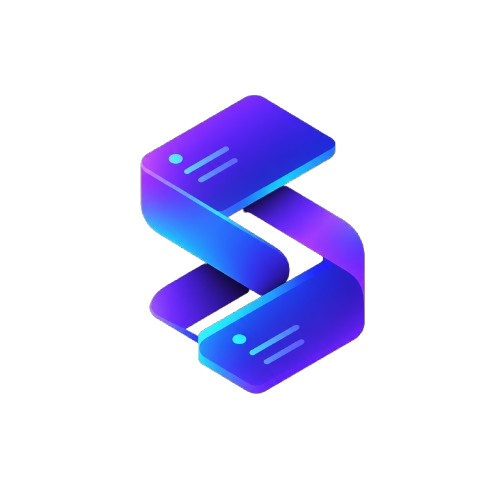

<p align="center">
  
</p>

<h1 align="center">SyncBoard</h1>

<p align="center">
  <strong>A real-time collaborative workspace built as a modular monolith — pairing Kanban boards and CRDT documents with a clean, microservice-ready architecture.</strong>
</p>

<p align="center">
  <a href="https://www.typescriptlang.org/"></a>
  <a href="https://nodejs.org/"></a>
  <a href="https://nestjs.com/"></a>
  <a href="https://react.dev/"></a>
  <a href="https://www.postgresql.org/"></a>
  <a href="https://redis.io/"></a>
  <a href="https://www.rabbitmq.com/"></a>
  <a href="https://socket.io/"></a>
  <a href="https://github.com/yjs/yjs"></a>
  <a href="docs/10-testing-strategy.md"></a>
</p>

### Quick Documentation Links
[Architecture](docs/01-architecture-overview.md) · [Database](docs/02-database-design.md) · [API](docs/03-api-design.md) · [WebSockets](docs/04-websocket-events.md) · [Realtime Engine](docs/05-realtime-engine.md) · [Auth & RBAC](docs/06-auth-and-rbac.md) · [Modules](docs/07-module-specifications.md) · [Queue](docs/08-message-queue-design.md) · [DevOps](docs/09-infrastructure-devops.md) · [Testing](docs/10-testing-strategy.md) · [Security](docs/11-security-checklist.md) · [Structure](docs/12-project-structure.md) · [Logging](docs/13-error-handling-logging.md) · [Test Catalogs](docs/test-cases/README.md) · [Screenshots](frontend/public/screenshots/)

---

## Table of Contents

- [1. Overview & Core Architecture](#1-overview--core-architecture)
- [2. Deep-Dive Architecture & Engineering Specifications](#2-deep-dive-architecture--engineering-specifications)
  - [2.1 System Architecture & Modular Monolith Topology](docs/01-architecture-overview.md)
  - [2.2 Database Architecture, LexoRank & Table Partitioning](docs/02-database-design.md)
  - [2.3 REST API Design, Response Envelopes & Pagination](docs/03-api-design.md)
  - [2.4 Real-Time WebSocket Protocol & Event Matrix](docs/04-websocket-events.md)
  - [2.5 Collaborative Document Engine & Yjs CRDT](docs/05-realtime-engine.md)
  - [2.6 Authentication, Session Security & Multi-Tenant RBAC](docs/06-auth-and-rbac.md)
  - [2.7 Domain Modules & Sub-Feature Specifications](docs/07-module-specifications.md)
  - [2.8 Message Queue, Asynchronous Processing & DLX Architecture](docs/08-message-queue-design.md)
  - [2.9 Infrastructure, Containerization & Object Storage](docs/09-infrastructure-devops.md)
  - [2.10 Testing Strategy & Automated Test Coverage](docs/10-testing-strategy.md)
  - [2.11 Security Practices & Checklist](docs/11-security-checklist.md)
  - [2.12 Monorepo Project Structure & Placement Rules](docs/12-project-structure.md)
  - [2.13 Structured Logging, Error Envelopes & Observability](docs/13-error-handling-logging.md)
- [3. Frontend Companion (MVP Web Client Overview)](#3-frontend-companion-mvp-web-client-overview)
- [4. Getting Started & Quickstart Guide](#4-getting-started--quickstart-guide)

---

## 1. Overview & Core Architecture

**SyncBoard** is a real-time collaborative workspace built around a modular monolith backend in **NestJS 11** and **Node.js 20 LTS**. It brings together fast, interactive Kanban boards, conflict-free rich-text document editing (via CRDTs), and multi-tenant workspace management. The system is designed with decoupled domain boundaries and event-driven communication, keeping deployment simple while remaining ready to extract into independent microservices as scale demands.

To showcase and test these backend capabilities end-to-end, the project includes a **companion React 19 Single Page Application (SPA) client**. The frontend handles real-time WebSocket relays, presence indicators, optimistic updates, and REST API envelopes in a responsive UI designed for desktop, tablet, and mobile.

> **Screenshots**: UI captures are available in the [`frontend/public/screenshots/`](frontend/public/screenshots/) folder, with descriptions in [`frontend/README.md`](frontend/README.md#📸-screenshots).

```
┌────────────────────────────────────────────────────────────────────────┐
│                              FRONTEND                                  │
│  React 19 SPA · TypeScript 5 · Vite · Responsive Layout · Yjs Client   │
│  Socket.IO Client · HTML5 Native Drag & Drop · SVG Icon System         │
└───────────────────────────────────┬────────────────────────────────────┘
                                    │ HTTP / WSS
┌───────────────────────────────────▼────────────────────────────────────┐
│                              BACKEND                                   │
│  Node.js 20 LTS · NestJS 11 Modular Monolith · Strict TypeScript       │
│  Prisma ORM · Passport (RS256 JWT & OAuth) · LexoRank · Pino · Joi     │
└───────┬───────────────────┬───────────────────┬────────────────┬───────┘
        │                   │                   │                │
┌───────▼────────┐  ┌───────▼────────┐  ┌───────▼────────┐ ┌─────▼───────┐
│   PostgreSQL   │  │    Redis 7     │  │  RabbitMQ 3.13 │ │ MinIO / S3  │
│  Relational DB │  │ Cache/Presence │  │ Message Broker │ │ Object Store│
│  Partitioning  │  │ Socket Adapter │  │  DLX & Retries │ │ Presigned   │
└────────────────┘  └────────────────┘  └────────────────┘ └─────────────┘
```

### High-Level Capabilities & Named Technology Matrix

| Domain Feature | Architectural Capabilities | Primary Libraries & Technologies |
|---|---|---|
| **Kanban Engine** | Drag-and-drop board lists & cards, LexoRank $O(1)$ reordering, card archives, soft-deletion | `lexorank`, `@hello-pangea/dnd`, React 19, TypeScript |
| **Card Domain Enrichment** | Subcards (depth $\le 2$) with progress rollup, custom fields (`text`, `number`, `date`, `select`, `user`), dependencies (`blocks`, `relates_to`), time tracking, priority (`lowest`…`urgent`), status (`not_started`…`closed`) | Prisma ORM, PostgreSQL 16, `class-validator`, `class-transformer` |
| **Collaborative Docs** | Real-time concurrent document editing, binary CRDT state vectors, debounced 5s persistence, awareness cursors, preview extraction | `yjs`, `socket.io`, `socket.io-client`, PostgreSQL `BYTEA` |
| **Multi-View Projections** | Realtime Kanban view, Sortable/Filterable Table view, Due-Date Calendar view, Creation Timeline view | React 19, SVG Icon System, CSS Modules |
| **Realtime Presence** | Multiplexed WebSocket rooms, dual-key Redis tracking (30s heartbeat, 60s reaping), per-event sliding window rate limiting | `socket.io`, `@socket.io/redis-adapter`, `ioredis` |
| **Multi-Tenant RBAC** | Strict workspace isolation, 4-tier roles (`owner`, `admin`, `member`, `viewer`), per-request DB role verification | NestJS Guards, Passport.js, PostgreSQL relational joins |
| **Auth & Sessions** | RS256 15m access JWT, 7d rotating refresh tokens in `HttpOnly` cookies, token reuse family invalidation, Redis JTI blacklist | `jsonwebtoken`, `passport-jwt`, `passport-google-oauth20`, `bcrypt` |
| **Async Messaging** | Decoupled domain events, dead-letter exchanges (DLX), exponential backoff wait queues, idempotent consumers | RabbitMQ 3.13, `@golevelup/nestjs-rabbitmq`, `amqplib`, `@nestjs/event-emitter` |
| **2-Phase File Uploads** | Direct-to-storage presigned S3 uploads (`pending` $\to$ client PUT $\to$ `/confirm` $\to$ `completed`), zero server RAM buffering | AWS SDK v3 (`@aws-sdk/client-s3`, `@aws-sdk/s3-request-presigner`), MinIO |
| **Time-Partitioned Audit** | High-volume activity event logging, monthly range partitions, zero-cost partition dropping for data retention | PostgreSQL 16 Partitioned Tables, Custom SQL |
| **Observability & Health** | Structured JSON logging with field redaction, correlation IDs (`X-Request-Id`), Terminus probes | `pino`, `nestjs-pino`, `pino-http`, `@nestjs/terminus` |
| **Test Coverage** | 100% real unit test coverage across all backend services, controllers, listeners, and utilities (1,227+ passing unit tests) | `jest`, `supertest` |

---

## 2. Deep-Dive Architecture & Engineering Specifications

This section summarizes each engineering document in sequence. For full implementation details, open the linked doc for that section.

---

### 2.1 System Architecture & Modular Monolith Topology ([docs/01-architecture-overview.md](file:///m:/Coding/Github/sync-board/docs/01-architecture-overview.md))

SyncBoard is structured as a **modular monolith** running within a single NestJS process. The system combines strict domain encapsulation with the operational simplicity of a single deployable unit, while keeping modules cleanly decoupled so they can be extracted into standalone microservices:

* **Decoupled Domain Modules**: Modules (`auth`, `workspace`, `board`, `document`, `notification`, `activity`, `file`, `mail`) expose clear public service contracts with no direct cross-module database access.
* **Microservices-Ready**: Domain boundaries and event-driven communication are designed so individual modules can be easily extracted into independent microservices when scaling requirements call for it.
* **Decoupled Event Bus**: Side effects (audit logging, email dispatch, notification fan-out) are emitted as domain events via `EventEmitter2` locally and published to RabbitMQ asynchronously.
* **Pipeline Lifecycle**: Incoming requests pass through an edge reverse proxy (Nginx with SSL termination and rate limiting) $\to$ `CorrelationIdInterceptor` (`X-Request-Id`) $\to$ `JwtAuthGuard` (RS256 & Redis token blacklist) $\to$ `WorkspaceMemberGuard` (tenant RBAC verification) $\to$ `ValidationPipe` (strict DTO parsing) $\to$ Domain Services $\to$ Prisma ORM $\to$ Standardized Envelope Response.

→ [Architecture Overview](docs/01-architecture-overview.md) — topology, request pipeline, and module boundary rules.

---

### 2.2 Database Architecture, LexoRank & Table Partitioning ([docs/02-database-design.md](file:///m:/Coding/Github/sync-board/docs/02-database-design.md))

The persistent storage tier is powered by **PostgreSQL 16** with schemas managed through **Prisma ORM** and enriched with custom SQL migrations for advanced indexing, constraints, and partitioning:

* **Relational Schema**: Enforces relational integrity across multi-tenant boundaries (Users, Workspaces, WorkspaceMembers, Boards, BoardLists, Cards, Comments, Attachments, Documents, and Activities).
* **Custom PostgreSQL ENUMs**: Domain-level types (`workspace_role`, `card_priority`, `card_status`, `attachment_status_enum`, `invitation_status`).
* **LexoRank Algorithm ($O(1)$ Ordering)**: Reordering cards or lists updates only the single affected row using string-based fractional indexing midpoints (e.g. `"0|hzzzzz:"` and `"0|i00000:"` $\to$ `"0|hzzzzz:8"`), eliminating cascading table write locks.
* **Time-Partitioned Audit Logs**: The `activities` table utilizes PostgreSQL monthly range partitioning (`PARTITION BY RANGE (created_at)`), ensuring high write throughput and zero-cost historical partition dropping for data retention compliance.
* **Composite & Partial Indexes**: Targeted indexing for active records (`WHERE deleted_at IS NULL`), pending invitation email lookups, and fast card list ordering.

→ [Database Design](docs/02-database-design.md) — ER diagrams, SQL schemas, partition triggers, and indexing strategies.

---

### 2.3 REST API Design, Response Envelopes & Pagination ([docs/03-api-design.md](file:///m:/Coding/Github/sync-board/docs/03-api-design.md))

SyncBoard's REST API adheres to strict consistency and predictable contract envelopes across all endpoints:

* **Standard Envelope Format**: Every response is wrapped in a consistent structure:
  * **Success**: `{ success: true, data: T, meta: { timestamp, requestId, pagination? } }`
  * **Error**: `{ success: false, error: { code, message, details? }, meta: { timestamp, requestId } }`
* **Dual Pagination Architecture**:
  * **Keyset / Cursor Pagination (`cursor`, `limit`)**: Used for high-frequency or unbounded append-only feeds (activity logs, notifications, comments) to guarantee deterministic reads without offset-drift.
  * **Offset Pagination (`page`, `limit`)**: Used for bounded administrative grids (workspace lists, member rosters).
* **Idempotency Controls**: Mutation operations accept an `Idempotency-Key` header cached in Redis to guard against duplicate transactions from network retries.
* **Sliding-Window Rate Limiting**: Enforced globally and tuned per-route (stricter limits on `/api/auth/*` endpoints) using Redis sliding logs.

→ [API Design](docs/03-api-design.md) — error codes, header contracts, and pagination specs. Interactive schema at `/api/docs`.

---

### 2.4 Real-Time WebSocket Protocol & Event Matrix ([docs/04-websocket-events.md](file:///m:/Coding/Github/sync-board/docs/04-websocket-events.md))

Real-time capabilities are orchestrated via **Socket.IO 4.8** backed by `@socket.io/redis-adapter` for seamless horizontal scalability:

* **Multiplexed Gateways**: Separated into dedicated gateways (`BoardGateway`, `DocumentGateway`, `NotificationPushGateway`).
* **Room-Scoped Isolation**: Sockets join fine-grained rooms (`board:${boardId}`, `doc:${documentId}`, `user:${userId}`). Broadcasts are strictly isolated to authenticated members of the active room.
* **Dual-Key Presence Engine**:
  * Redis `SET` with 30s TTL periodically refreshed by client heartbeat pings.
  * Redis Sorted Set (`ZSET`) storing timestamps for deterministic viewer counting and ghost reaping (60s inactivity threshold).
* **Event Relay Contracts**: Immediate client reflection for board modifications, card moves, list reorganizations, and viewer joining/leaving notifications.

→ [WebSocket Events](docs/04-websocket-events.md) — full event list, payload schemas, and presence algorithms.

---

### 2.5 Collaborative Document Engine & Yjs CRDT ([docs/05-realtime-engine.md](file:///m:/Coding/Github/sync-board/docs/05-realtime-engine.md))

Collaborative document editing leverages **Yjs 13.6** Conflict-free Replicated Data Types (CRDTs) to guarantee convergence without centralized merge locks:

* **Binary State Vector Sync**: Two-step handshake (`sync-step-1` exchanging local state vectors, `sync-step-2` streaming missing binary updates) ensures minimal bandwidth consumption.
* **In-Memory Buffer with Debounced Persistence**: Active document sessions are maintained in server memory. Document updates are accumulated and flushed to PostgreSQL `BYTEA` storage on a 5-second debounce window or upon session teardown.
* **Real-Time Awareness**: Broadcasts peer cursor selections, remote carets, display names, and distinct avatar colors without database writes.
* **Snapshot Versioning**: Periodic named snapshots allow workspace members to inspect historical revisions and restore documents to prior states.

→ [Realtime Engine](docs/05-realtime-engine.md) — CRDT state vector lifecycle, debounce flush, and awareness protocols.

---

### 2.6 Authentication, Session Security & Multi-Tenant RBAC ([docs/06-auth-and-rbac.md](file:///m:/Coding/Github/sync-board/docs/06-auth-and-rbac.md))

The authentication and session architecture is designed for secure token handling and strict multi-tenant isolation:

* **RS256 Asymmetric Tokens**: Access tokens (15-minute lifetime) are signed via private RSA key and verified with a public key, eliminating database lookups on authenticated REST calls.
* **Rotating Refresh Tokens in HttpOnly Cookies**: 7-day refresh tokens are securely stored in `HttpOnly`, `SameSite=Strict` cookies. Each refresh request issues a new token pair and invalidates the previous token.
* **Reuse Detection & Family Invalidation**: Replaying an expired or previously consumed refresh token triggers immediate invalidation of the entire user session family.
* **Redis JTI Blacklist**: Logout (`/api/auth/logout`) and global revocation (`/api/auth/logout-all`) record token JTIs in Redis with remaining TTLs to instantly revoke compromised access tokens.
* **Hierarchical Workspace RBAC**: 4 distinct roles (`owner` > `admin` > `member` > `viewer`) verified per-request by `WorkspaceMemberGuard` to ensure tenant isolation.

→ [Auth & RBAC](docs/06-auth-and-rbac.md) — token flow diagrams, cryptographic specs, and RBAC matrix.

---

### 2.7 Domain Modules & Sub-Feature Specifications ([docs/07-module-specifications.md](file:///m:/Coding/Github/sync-board/docs/07-module-specifications.md))

The core business logic is organized into clean domain modules supporting an extensive collaborative feature set:

* **Workspaces & Members**: Tenant creation, slug generation, email invitations, member administration, and ownership transfer.
* **Boards & Lists**: Customizable Kanban boards, list workflow stages, board starring, background colors, and soft-delete archiving.
* **Cards & Subcards**: Cards support rich descriptions, priority flags (`lowest` to `urgent`), and hierarchical subcards (depth $\le 2$) with automatic parent completion percentage calculation.
* **Custom Fields System**: Flexible custom attribute definitions (`text`, `number`, `date`, `select`, `user`) attached to cards with strict type validation.
* **Time Tracking**: Granular work duration logging with start/end timestamps, billable status, and per-card aggregate metrics.
* **Checklists**: Task checklists with toggleable items and real-time progress bars.
* **Card Attachments & Dependencies**: S3 file metadata management and dependency linking (`blocks`, `is_blocked_by`, `relates_to`).
* **Comments & `@mentions`**: Threaded discussion trees (depth $\le 1$), mention parsing regex (`/@([a-z0-9._%+-]+@[a-z0-9.-]+\.[a-z]{2,})/gi`), canonical email normalization, and asynchronous member notification fan-out.

→ [Module Specs](docs/07-module-specifications.md) — entity schemas, validation rules, and business logic per domain.

---

### 2.8 Message Queue, Asynchronous Processing & DLX Architecture ([docs/08-message-queue-design.md](file:///m:/Coding/Github/sync-board/docs/08-message-queue-design.md))

SyncBoard uses **RabbitMQ 3.13** via `@golevelup/nestjs-rabbitmq` for background processing and decoupled event streaming:

* **Topic Exchanges**:
  * `notification.exchange`: Routes card assignments, mentions, and role changes (`notification.*`).
  * `activity.exchange`: Ingests high-velocity audit log events (`activity.*`).
  * `email.exchange`: Dispatches transactional verification and invite emails (`email.*`).
* **Dead-Letter Exchange (DLX) & Exponential Backoff**:
  * Poison or failing messages route to `notification.dlx` with configured retry queues (`x-dead-letter-exchange`, `x-message-ttl`).
  * Exponential backoff delays retries up to 3 times before terminal dead-lettering.
* **Idempotent Consumers**: Consumers implement `consumeOnce` leveraging Redis atomic keys (`msg:processed:<id>`) to guarantee exactly-once execution despite network duplicates.

→ [Message Queue Design](docs/08-message-queue-design.md) — queue topology, retry policies, and routing key constants.

---

### 2.9 Infrastructure, Containerization & Object Storage ([docs/09-infrastructure-devops.md](file:///m:/Coding/Github/sync-board/docs/09-infrastructure-devops.md))

The repository provides automated Docker Compose definitions enabling one-command local startup of the complete platform:

* **Container Topology**: PostgreSQL 16 (Primary), Redis 7, RabbitMQ 3.13, MinIO S3, and MailHog SMTP daemon.
* **Full Stack Profile (`--profile full`)**: Launches PostgreSQL streaming read replicas, a transaction-mode PgBouncer connection pooler, and an Nginx edge proxy with sticky sessions.
* **2-Phase Presigned S3 Uploads**:
  1. Client sends file metadata to `POST /api/cards/:id/attachments/presign`.
  2. Backend signs a direct S3 PUT URL via `@aws-sdk/s3-request-presigner`.
  3. Client uploads directly to MinIO/S3 (zero server RAM consumption).
  4. Client invokes `POST /confirm` to verify object size and activate attachment metadata.

→ [Infrastructure & DevOps](docs/09-infrastructure-devops.md) — Docker Compose configs, port mappings, and S3 CORS policies.

---

### 2.10 Testing Strategy & Automated Test Coverage ([docs/10-testing-strategy.md](file:///m:/Coding/Github/sync-board/docs/10-testing-strategy.md))

The codebase is thoroughly tested with an automated unit test suite:

* **100% Unit Test Coverage**: Every service, controller, repository, interceptor, guard, and event listener maintains 100% branch, statement, function, and line coverage.
* **Isolated Unit Tests**: Tests execute with isolated unit mocks and in-memory repositories, ensuring fast and reliable CI runs without external network dependencies.
* **1,227+ Passing Tests**: Automated test suite covering all core business domains.

```bash
# Run complete unit test suite with coverage report
npm run test:cov
```

→ [Testing Strategy](docs/10-testing-strategy.md) — methodology, test categories, and coverage thresholds.

---

### 2.11 Security Practices & Checklist ([docs/11-security-checklist.md](file:///m:/Coding/Github/sync-board/docs/11-security-checklist.md))

SyncBoard implements layered security controls across the application:

* **HTTP Header Protection**: Configured with `helmet` for Content Security Policy (CSP), Strict-Transport-Security (HSTS), and clickjacking prevention.
* **Strict CORS Controls**: Whitelisted origins with credential support (`Access-Control-Allow-Credentials: true`).
* **Input Validation & Sanitization**: `ValidationPipe` with `whitelist: true` and `forbidNonWhitelisted: true` prevents parameter injection and mass assignment.
* **Password Hashing**: Salted cryptographic hashing powered by `bcrypt` (12 rounds).
* **Upload Security**: Magic-byte MIME type inspection, file extension whitelisting, and strict size caps on S3 presigned URLs.

→ [Security Checklist](docs/11-security-checklist.md) — full production security checklist.

---

### 2.12 Monorepo Project Structure & Placement Rules ([docs/12-project-structure.md](file:///m:/Coding/Github/sync-board/docs/12-project-structure.md))

The codebase maintains a clear modular structure and separation of concerns:

* **Backend (`src/`)**: Organized into `modules/<domain>/` containing dedicated subdirectories for `controllers`, `services`, `repositories`, `dto`, `events`, and `listeners`.
* **Shared Infrastructure (`src/common/`)**: Reusable components (`database`, `redis`, `rabbitmq`, `guards`, `interceptors`, `filters`, `exceptions`, `utils`).
* **Companion Frontend (`frontend/`)**: Modular React 19 SPA client organized by features, shared UI components, API clients, and state stores.

→ [Project Structure](docs/12-project-structure.md) — directory maps, naming conventions, and import boundaries.

---

### 2.13 Structured Logging, Error Envelopes & Observability ([docs/13-error-handling-logging.md](file:///m:/Coding/Github/sync-board/docs/13-error-handling-logging.md))

Observability and structured logging are built directly into the application:

* **Structured JSON Logging**: Powered by `pino` and `nestjs-pino` with automatic field redaction (masking passwords, JWTs, and authorization headers).
* **Distributed Request Tracing**: `X-Request-Id` correlation IDs follow each operation across HTTP requests, service executions, and background message queues.
* **Exception Hierarchy**: Unified application exceptions (`AppException`, `BusinessRuleException`, `EntityNotFoundException`) caught by `GlobalExceptionFilter` and formatted into standard error envelopes.
* **Health Probes**: Terminus endpoints at `/api/health` report live health checks on PostgreSQL, Redis, RabbitMQ, and object storage.

→ [Logging & Observability](docs/13-error-handling-logging.md) — error envelopes, log levels, and health monitoring.

---

## 3. Frontend Companion (MVP Web Client Overview)

To provide an intuitive, production-grade interface for testing and interacting with the backend architecture, SyncBoard includes a **responsive React 19 Single Page Application (SPA)** client built with TypeScript, Vite, and modern CSS:

* **Interactive Kanban Board**: Drag-and-drop lists and cards with real-time LexoRank position syncing and optimistic UI updates.
* **CRDT Document Editor**: Real-time collaborative document editing synchronized over Yjs WebSockets with remote awareness cursors and autosave indicators.
* **Multi-View Projections**: Smooth switching between Kanban Board, Sortable Data Table, Due-Date Calendar, and Creation Timeline views.
* **Card Detail Hub**: Subcards with progress rollups, custom fields, checklists, time tracking logs, file attachments, and dependency links.
* **Comment `@mentions` System**: Typing `@` triggers autocomplete for workspace members, normalizes mentions to canonical emails, and displays styled `@DisplayName` badges with full-name tooltips.
* **Real-Time Notification Popover**: Live unread badge count updated via WebSockets with deep-link navigation directly into cards and comment threads.
* **Responsive Layout**: Mobile navigation drawer, fluid grids, and a crisp SVG vector icon system that adapts smoothly from phones to widescreen monitors.

> 📸 **Screenshots**: All screenshots are stored in the [`frontend/public/screenshots/`](frontend/public/screenshots/) folder. To view them with descriptions of each interface and view, see [**Frontend Screenshots**](frontend/README.md#📸-screenshots).

## 4. Getting Started & Quickstart Guide

### Prerequisites

Ensure you have the following installed locally:
* **Node.js**: `20.x LTS` or higher
* **npm**: `10.x` or higher
* **Docker & Docker Compose**: Docker Engine `24.x+` and Docker Compose `v2.x+`

---

### Step 1: Clone Repository & Configure Environment

```bash
# Clone the repository
git clone https://github.com/1mimhe/sync-board.git
cd sync-board

# Copy environment template
cp .env.example .env
```

---

### Step 2: Boot Supporting Infrastructure Containers

Start PostgreSQL, Redis, RabbitMQ, MinIO, and MailHog using Docker Compose:

```bash
# Start all core backing services in the background
docker compose up -d

# Verify all containers are healthy
docker compose ps
```

---

### Step 3: Install Dependencies & Run Database Migrations

```bash
# Install backend dependencies
npm install

# Run database migrations and generate Prisma client
npx prisma migrate dev

# Seed database with sample workspaces, boards, and demo users
npm run prisma:seed
```

---

### Step 4: Launch Backend API Server

```bash
# Start NestJS backend in development mode (port 3000)
npm run start:dev
```

The backend API is now running at `http://localhost:3000`. You can inspect:
* **Swagger API Documentation**: [http://localhost:3000/api/docs](http://localhost:3000/api/docs)
* **System Health Check**: [http://localhost:3000/api/health](http://localhost:3000/api/health)

---

### Step 5: Launch Frontend Web Application

Open a second terminal window to start the companion React client:

```bash
# Navigate to frontend directory and install dependencies
cd frontend
npm install

# Start Vite development server (port 5173)
npm run dev
```

Open [http://localhost:5173](http://localhost:5173) in your browser to access the workspace.

---

### Service Port & URL Summary

| Service / Interface | Local URL | Default Credentials / Purpose |
|---|---|---|
| **Frontend Web App** | [http://localhost:5173](http://localhost:5173) | Interactive workspace interface |
| **Backend REST API** | [http://localhost:3000/api](http://localhost:3000/api) | NestJS application endpoints |
| **Swagger API Docs** | [http://localhost:3000/api/docs](http://localhost:3000/api/docs) | Interactive OpenAPI exploration |
| **API Health Probe** | [http://localhost:3000/api/health](http://localhost:3000/api/health) | Health status (Postgres, Redis) |
| **RabbitMQ Management** | [http://localhost:15672](http://localhost:15672) | `guest` / `guest` |
| **MinIO Object Console** | [http://localhost:9001](http://localhost:9001) | `minioadmin` / `minioadmin` |
| **MailHog Web Inbox** | [http://localhost:8025](http://localhost:8025) | Local email capture interface |

---

### Demo Seed Accounts

The database seed script initializes the following accounts:

| User Role | Email Address | Password | Permissions |
|---|---|---|---|
| **Platform Admin / Owner** | `admin@syncboard.dev` | `Password123!` | Full workspace ownership & settings |
| **Team Member** | `alex@syncboard.dev` | `Password123!` | Active collaboration & card management |
| **Guest / Viewer** | `sarah@syncboard.dev` | `Password123!` | Read-only board and document access |

---

### Useful Commands

```bash
# Run complete unit test suite with coverage report
npm run test:cov

# Run linter checks
npm run lint

# Build production bundle for backend
npm run build

# Build production bundle for frontend
cd frontend && npm run build
```
