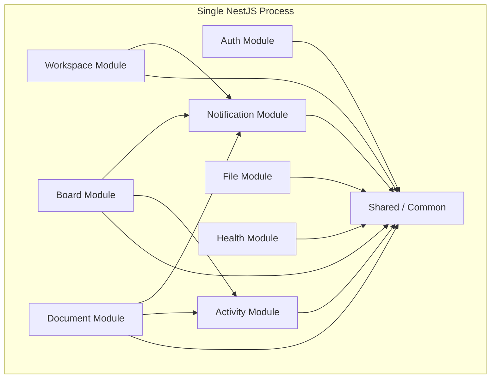
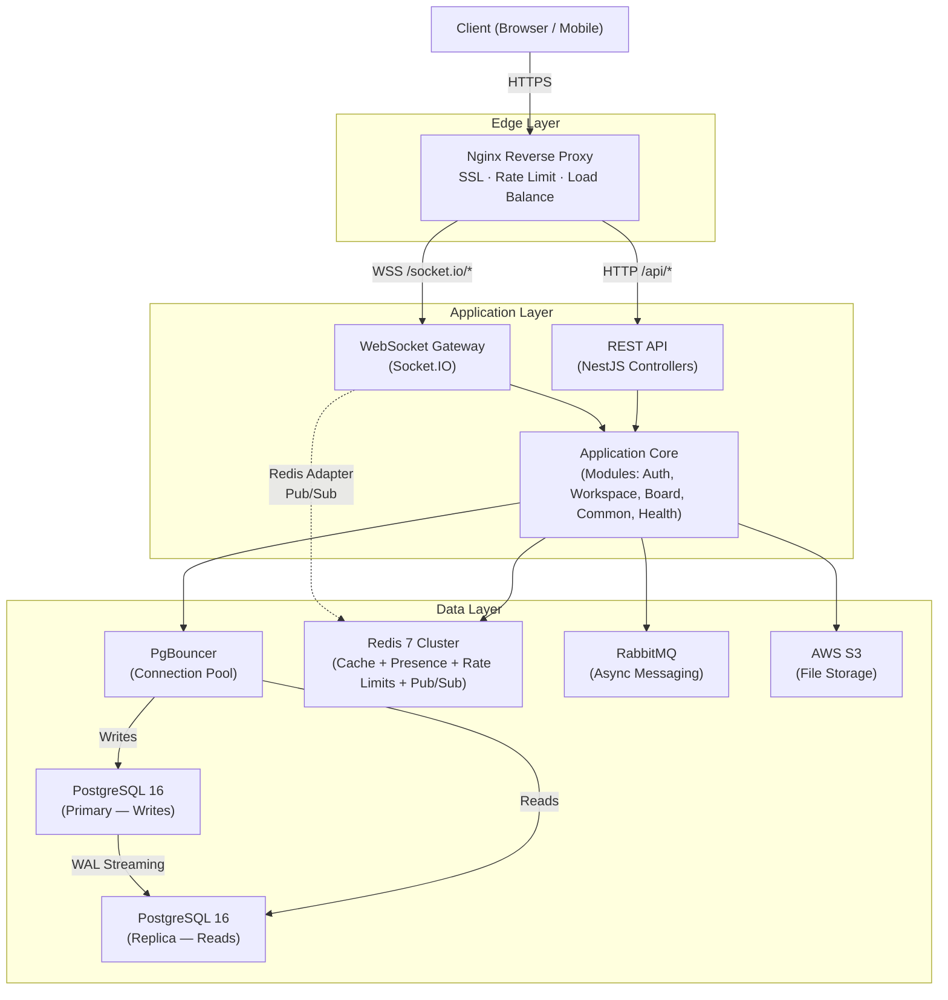
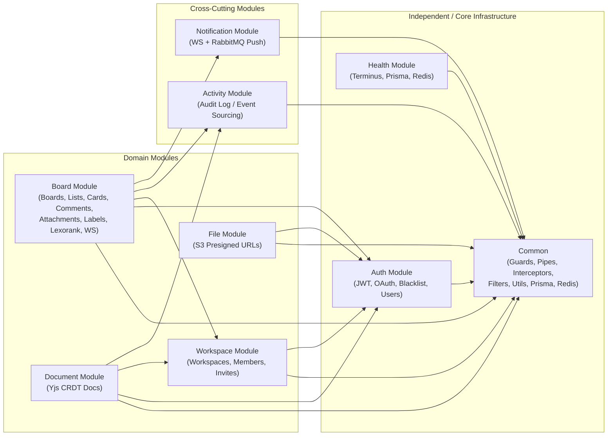
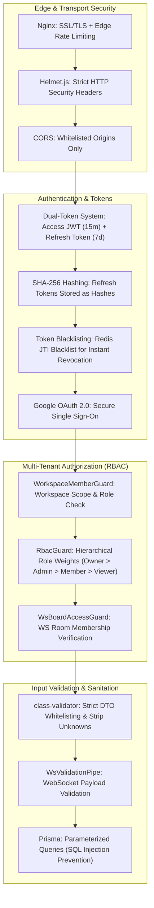

# 01 — Architecture Overview

## 1. Vision & Scope

**SyncBoard** is a real-time collaborative task & document platform combining Kanban board management (Trello-like), rich-text collaborative editing (Notion/Google Docs-like), and team workspace management — built as a **modular monolith** with production-grade real-time infrastructure.

### Core Capabilities
| Capability | Description |
|-----------|-------------|
| **Workspaces** | Multi-tenant team workspaces with invitation system and role-based permissions |
| **Kanban Boards** | Lists, cards, drag-and-drop ordering via Lexorank, assignees, labels, attachments |
| **Collaborative Docs** | Real-time rich-text editing via CRDT (Yjs) |
| **Real-Time Sync** | Live board/document updates, presence, and document awareness via Socket.IO + Redis Adapter |
| **Activity Audit** | Event-sourced append-only audit log for board and card activities |
| **Notifications** | In-app real-time notifications via WebSocket + RabbitMQ |
| **File Attachments** | S3 presigned URL uploads attached to cards/docs with metadata tracking |

---

## 2. Architectural Style: Modular Monolith



### What is a Modular Monolith?

A single deployable unit where code is organized into **strictly bounded modules** with explicit public APIs. Modules communicate via well-defined interfaces (service injection, events), NOT by reaching into each other's internals.

<details>
<summary><strong>💡 Why this choice over Microservices?</strong></summary>

| Factor | Modular Monolith | Microservices |
|--------|-----------------|---------------|
| **Complexity** | Single process, simple debugging | Network calls, distributed tracing needed |
| **Data consistency** | Database transactions across modules | Saga/eventual consistency |
| **Deployment** | One Docker image | Multiple images, orchestration |
| **Development speed** | Fast — refactor across modules freely | Slow — API contracts, versioning |
| **Team size needed** | 1-3 developers | 5+ developers per service |
| **Migration path** | Can extract to microservices later | Already distributed |

**A modular monolith gives the architectural discipline of microservices — explicit
boundaries, independent deployability of the whole — without the operational overhead
of distributed calls, tracing, and orchestration. Each module boundary is kept clean
enough that it could be extracted into a standalone service later if scale demands it.

</details>

### Module Boundary & Structure Rules

1. **No cross-module repository access** — modules never reach into another module's persistence layer.
2. **Communicate via exported services** — each module exposes a narrow service interface.
3. **Event-based decoupling** — side effects (notifications, activity logs) are triggered via domain events or the message queue, not direct calls.
4. **Shared module** — only truly shared concerns (guards, decorators, pipes, interceptors, filters, database config, redis infrastructure) live in the shared common module.
5. **Centralized module constants** — domain event strings, WebSocket event names, timing configs, and rate limit definitions live alongside their owning module and are re-exported for consumers.
6. **Consistent internal module layout**:
   - `controllers/` — HTTP routing and request handling
   - `services/` — business logic and transaction coordination
   - `repositories/` — encapsulated database queries
   - `dto/` — validated request and response models
   - `events/` — event payloads emitted across the event bus
   - `constants/` — event names, WebSocket message names, rate limits
   - `realtime/` — Socket.IO gateways and presence
   - `mappers/` — entity-to-DTO conversion

---

## 3. High-Level System Architecture



### Request Flow Examples

#### REST API Flow (e.g., Create a Card)
```
Client → Nginx → NestJS Controller → CorrelationIdInterceptor
→ Auth Guard (JWT) → WorkspaceMemberGuard (RBAC) → ValidationPipe
→ Card Controller → Card Service → LexorankService (compute rank)
→ Card Repository → PrismaService → PostgreSQL (Primary)
→ EventEmitter.emit('card.created', payload)
→ [Async] Activity Listener → Activity Repository → PostgreSQL
→ [Async] Notification Module → RabbitMQ → WebSocket broadcast
→ ResponseInterceptor: { success: true, data: CardResponseDto, meta: { timestamp, requestId } }
→ HTTP Response 201 Created
```

#### WebSocket Flow (e.g., Card Moved on Board)
```
Client → Nginx → Socket.IO Gateway (BoardGateway)
→ WsAuthGuard (validate handshake JWT + check token blacklist)
→ WsBoardAccessGuard (validate board membership & workspace access)
→ WsRateLimitGuard (sliding-window rate limiter in Redis)
→ WsValidationPipe (class-validator payload check)
→ BoardGateway Handler → CardService.moveCard() → CardRepository → PostgreSQL
→ EventEmitter.emit('card.moved', payload)
→ Activity Listener (async log entry)
→ server.to(boardRoom).emit('card:moved', updatedCard)
```

#### Collaborative Document Edit Flow
```
Client (Yjs) → WebSocket → Doc Gateway → Yjs Provider (y-websocket)
→ Merge CRDT update → Broadcast to document room
→ Periodic persistence → PostgreSQL (CRDT state as binary)
→ Activity Module (debounced log entry)
```

---

## 4. Technology Stack Rationale

| Layer | Technology | Version | Purpose |
|-------|-----------|---------|---------|
| **Runtime** | Node.js | 20 LTS | Standard LTS runtime |
| **Framework** | NestJS | 11.x | Modular DI framework with first-class WebSocket & validation support |
| **Language** | TypeScript | 5.x | Strict type safety across the entire application |
| **Database** | PostgreSQL | 16 | ACID-compliant relational data store |
| **Connection Pool** | PgBouncer | 1.22 | Transaction-mode connection pooling for high concurrency |
| **ORM** | Prisma | 7.x | Type-safe database queries, schema migrations, and client generation |
| **Cache / Pub-Sub** | Redis | 7.x (ioredis) | Session store, token blacklist, rate limiting, presence, Socket.IO adapter |
| **Message Broker** | RabbitMQ | 3.13 | Reliable async message delivery with dead-letter exchange |
| **Real-Time** | Socket.IO | 4.8.x | Bi-directional event-based WebSocket communication |
| **Ordering** | LexoRank | 1.0.x | String-based fractional indexing for Jira/Trello style drag-and-drop |
| **Auth** | Passport.js + JWT + Google OAuth | Latest | Access + Refresh token pair, SHA-256 token hashing, Google OAuth2 |
| **File Storage** | AWS S3 (via @aws-sdk/client-s3) | v3 | Direct client upload via presigned URLs |
| **API Docs** | @nestjs/swagger | 11.x | OpenAPI 3.0 automated documentation generation |
| **Logging** | nestjs-pino + pino-http | Latest | High-performance structured JSON logging with correlation IDs |
| **Testing** | Jest + ts-jest + Supertest | Latest | 100% unit test coverage target + integration & E2E suites |
| **Containerization** | Docker + Docker Compose | Latest | Local multi-service infrastructure replication |
| **Reverse Proxy** | Nginx | 1.25 | SSL termination, edge rate limiting, reverse proxying |

---

## 5. Module Dependency Graph



### Strict Dependency Inversion Rules
- **Common & Database**: Base layer, imported by all feature modules.
- **Auth**: Only depends on Common. Does not depend on Workspace or Board.
- **Workspace**: Depends on Auth (for user verification).
- **Board & Document**: Depend on Auth and Workspace for access control and workspace binding.
- **Activity & Notification**: Consumed via event decoupling (`EventEmitter2` / message queues) rather than tight direct coupling.

---

## 6. Communication Patterns

### Synchronous (Within Process)
| Pattern | Mechanism | Example |
|---------|-----------|---------|
| **Direct Service Injection** | NestJS Dependency Injection | `BoardService` injects `WorkspaceService` to verify workspace membership |
| **Guards** | `@UseGuards()` | `JwtAuthGuard`, `WorkspaceMemberGuard`, `RbacGuard`, `WsAuthGuard` |
| **Pipes** | `@UsePipes()` | `ValidationPipe` (HTTP), `WsValidationPipe` (WebSocket) |
| **Interceptors** | `@UseInterceptors()` | `CorrelationIdInterceptor` (request tracing), `ResponseInterceptor` (standard `{ success, data, meta }`) |
| **Filters** | `@UseFilters()` | `AllExceptionsFilter` (HTTP error envelope), `WsExceptionFilter` (WebSocket errors) |

### Asynchronous (Event-Driven)
| Pattern | Transport | Purpose | Example |
|---------|-----------|---------|---------|
| **In-Process Events** | NestJS `EventEmitter2` | Decoupled cross-module domain notifications | `board.card.moved` → `ActivityListener` |
| **Message Queue** | RabbitMQ | Guaranteed delivery for async background tasks | Email invitations, system push notifications |
| **Redis Pub/Sub** | `@socket.io/redis-adapter` | Multi-instance WebSocket synchronization | Multi-server broadcast to `board:{id}` rooms |
| **WebSocket Rooms** | Socket.IO | Real-time client updates and live cursors | `card:moved`, `presence:state`, `user:typing` |

---

## 7. Deployment Topology

### Development (Docker Compose)
```
┌──────────────────────────────────────────────┐
│              Docker Compose                   │
│                                              │
│  ┌──────────┐  ┌──────────┐  ┌──────────┐   │
│  │ app      │  │ postgres │  │ postgres │   │
│  │ (NestJS) │  │ (primary)│  │ (replica)│   │
│  │ :3000    │  │ :5432    │  │ :5433    │   │
│  └──────────┘  └──────────┘  └──────────┘   │
│                                              │
│  ┌──────────┐  ┌──────────┐  ┌──────────┐   │
│  │ pgbouncer│  │  redis   │  │ rabbitmq │   │
│  │ :6432    │  │  :6379   │  │ :5672    │   │
│  └──────────┘  └──────────┘  │ :15672   │   │
│                              └──────────┘   │
│  ┌──────────┐                               │
│  │  nginx   │                               │
│  │  :80/443 │                               │
│  └──────────┘                               │
└──────────────────────────────────────────────┘
```

### Production (AWS)
```
┌─────────────────────────────────────────────────────┐
│                    AWS VPC                           │
│                                                     │
│  ┌──────────────┐     ┌────────────────────────┐    │
│  │   ALB        │     │  EC2 / ECS Cluster     │    │
│  │  (HTTPS)     │────▶│  ┌──────┐ ┌──────┐     │    │
│  │              │     │  │App 1 │ │App 2 │     │    │
│  └──────────────┘     │  └──────┘ └──────┘     │    │
│                       └────────────────────────┘    │
│                                                     │
│  ┌──────────────┐  ┌──────────────┐  ┌──────────┐  │
│  │ RDS Postgres │  │ ElastiCache  │  │ Amazon   │  │
│  │ (Multi-AZ)   │  │ (Redis)      │  │ MQ       │  │
│  └──────────────┘  └──────────────┘  └──────────┘  │
│                                                     │
│  ┌──────────────┐                                   │
│  │  S3 Bucket   │                                   │
│  │  (Files)     │                                   │
│  └──────────────┘                                   │
└─────────────────────────────────────────────────────┘
```

---

## 8. Cross-Cutting Concerns

| Concern | Architectural Solution |
|---------|------------------------|
| **Authentication** | Dual-token JWT architecture (Short-lived Access Token + HTTP-only Refresh Token). |
| **Authorization** | Workspace-level Role-Based Access Control (`Owner`, `Admin`, `Member`, `Viewer`). |
| **Data Validation** | Class-validator DTOs enforced globally via NestJS `ValidationPipe`. |
| **Error Handling** | Standardized error format with machine-readable error codes and requestId correlation. |
| **Logging & Audit** | Structured JSON logging with Pino; append-only audit trail in PostgreSQL. |
| **API Documentation**| OpenAPI/Swagger auto-generated specs at `/api/docs`. |

### Error Handling & Response Uniformity
- **Custom Exceptions**: Domain exceptions inherit from `AppException` (`EntityNotFoundException`, `BusinessRuleException`).
- **HTTP Filter**: `AllExceptionsFilter` intercepts all exceptions and formats them into a strict standard envelope:
  ```json
  {
    "success": false,
    "error": {
      "code": "CARD_NOT_FOUND",
      "message": "Card with ID 123 does not exist",
      "statusCode": 404,
      "details": {}
    },
    "meta": {
      "timestamp": "2026-08-24T00:00:00.000Z",
      "requestId": "c1f72b9a-4c28-4e1b-8732-..."
    }
  }
  ```
- **WebSocket Filter**: `WsExceptionFilter` emits structured `error` events to the socket without disconnecting the client.
- **Success Interceptor**: `ResponseInterceptor` wraps all successful responses in `{ success: true, data: ..., meta: { timestamp, requestId } }`.

### Logging & Observability
- **Pino Structured Logging**: `nestjs-pino` with JSON output and sensitive data redaction (passwords, tokens, credentials).
- **Request Tracing**: `CorrelationIdInterceptor` assigns a unique `X-Request-Id` UUID to every request and injects it into response headers and Pino child loggers.

### Configuration & Health
- **Config Validation**: Joi schema validates all environment variables at startup, failing fast on missing or invalid configurations.
- **Health Checks**: `@nestjs/terminus` monitors PostgreSQL (via `PrismaHealthIndicator`) and Redis (via `RedisHealthIndicator`).

---

## 9. Performance & Scalability Architecture

| Concern | Architectural Solution |
|---------|------------------------|
| **Connection Exhaustion** | PgBouncer in transaction pooling mode prevents PostgreSQL connection saturation. |
| **Read/Write Splitting** | Write queries target Primary PostgreSQL; read-heavy queries target Streaming Replica. |
| **Horizontal WS Scaling** | `@socket.io/redis-adapter` syncs room events across multiple Node.js application instances. |
| **List/Card Drag & Drop** | String-based fractional indexing (`LexoRank`) allows inserting between cards with $O(1)$ updates without re-indexing all subsequent cards. |
| **Presence Sync** | Ephemeral Redis Hashes and Sorted Sets store active board viewer state with automatic TTL expiration. |
| **Rate Limiting** | Sliding-window Redis pipelines enforce rate limits per socket event type (`presence`, `card_move`). |
| **File Storage Offloading** | Client uploads directly to AWS S3 via presigned PUT URLs; application server never buffers large payloads. |

---

## 10. Security Architecture



---

## 11. Testing Architecture & Verification Strategy

SyncBoard follows a multi-tiered testing strategy: unit tests for business logic and
infrastructure adapters, integration tests against real PostgreSQL/Redis, and
end-to-end HTTP + WebSocket journeys. Details in `10-testing-strategy.md`.

```
                  ┌───────────────┐
                  │   E2E Tests   │  End-to-end user journeys (HTTP & WS)
                  └───────┬───────┘
                          │
                  ┌───────┴───────┐
                  │  Integration  │  Real PostgreSQL, Redis via Testcontainers
                  └───────┬───────┘
                          │
          ┌───────────────┴───────────────┐
          │      Unit Test Foundation     │  Services, Repos, Controllers,
          │                               │  Guards, Filters, Utils, Mappers,
          │                               │  Listeners, Tasks, Indicators
          └───────────────────────────────┘
```

### Core Testing Principles
1. **High coverage baseline**: controllers, services, repositories, guards, filters, interceptors, pipes, mappers, listeners, utils, health indicators, and scheduled tasks are covered for both happy and edge paths.
2. **Boundary Mocking**: services mock repositories; repositories mock `PrismaService`; gateways mock WebSocket server/clients; guards and filters mock `ExecutionContext` / `ArgumentsHost`.
3. **Exhaustive Edge Case Verification**: boundary values, error mappings, race conditions, permission boundaries, token revocations, and invalid payload shapes are systematically tested.
4. **Co-located Test Specs**: unit test files live in dedicated `__tests__/` subdirectories matching the source structure.