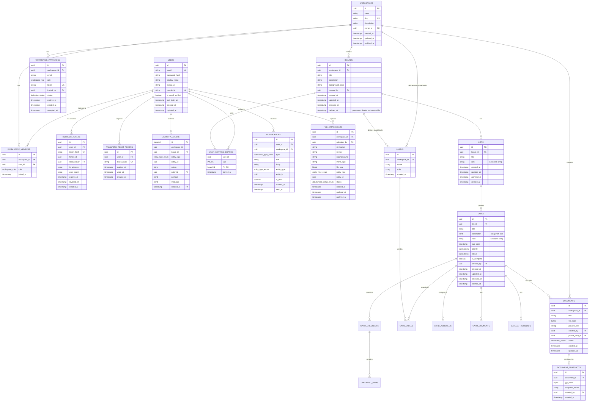
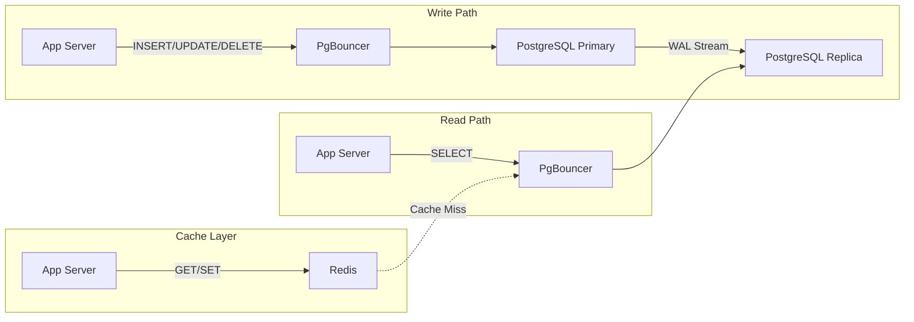

# 02 — Database Design

## 1. Design Principles

| Principle | Application |
|-----------|------------|
| **Normalize first, denormalize later** | Start with 3NF; denormalize only when profiling demonstrates a measurable bottleneck |
| **UUIDs as primary keys** | Prevents sequential enumeration attacks and enables effortless distributed sharding |
| **Timestamps everywhere** | Every table tracks `created_at` and `updated_at` for rigorous auditability |
| **Soft deletes for user content (two-stage)** | Boards, lists, cards use `archived_at` (restorable) + `deleted_at` (permanent, unretrievable) |
| **Hard deletes for system data** | Expired tokens, consumed invitations, and transient sessions are truly purged |
| **JSONB for flexible content** | Card descriptions (Tiptap schema), custom field values, and activity payloads |
| **Native ENUM types** | Enforces domain boundaries directly at the database level |

---

## 2. Entity Relationship Diagram



---

## 3. Schema Architecture by Domain

The complete schema is declared in [`prisma/schema.prisma`](file:///m:/Coding/Github/sync-board/prisma/schema.prisma) with non-Prisma capabilities (partial indexes, GIN indexes, declarative range partitioning) applied via migrations. Below is the domain-by-domain architectural specification.

### 3.1 Users & Authentication

| Table | Purpose | Key Attributes & Constraints | Architectural Decision |
|-------|---------|------------------------------|------------------------|
| `users` | User accounts and identities | `email` (unique), `password_hash` (nullable for OAuth), `google_id` (unique, nullable), `is_email_verified` | Centralizes local and OAuth SSO identities in a single record. |
| `refresh_tokens` | Multi-device session rotation | `token_hash` (SHA-256 unique), `family_id` (UUID), `replaced_by` (FK self), `expires_at`, `revoked_at` | **Rotation with Reuse Detection**: Presenting a revoked token triggers revocation of its entire `family_id` chain. |
| `password_reset_tokens` | Recovery tokens | `user_id`, `token_hash`, `expires_at` (1h TTL), `used_at` | One-time recovery tokens consumed atomically. |

---

### 3.2 Workspaces & Membership

| Table | Purpose | Key Attributes & Constraints | Architectural Decision |
|-------|---------|------------------------------|------------------------|
| `workspaces` | Multi-tenant tenant container | `name`, `slug` (unique), `description`, `owner_id` (FK `users`) | All boards, documents, and labels are scoped to a workspace. |
| `workspace_members` | User-workspace association | Composite unique `(workspace_id, user_id)`, `role` (`owner`, `admin`, `member`, `viewer`), `joined_at` | RBAC role weights: Owner (100) > Admin (50) > Member (10) > Viewer (0). |
| `workspace_invitations` | Pending team invites | `workspace_id`, `email`, `role`, `token` (unique), `status` (`pending`, `accepted`, `revoked`, `expired`) | Secure cryptographic token invites valid for 7 days. |

---

### 3.3 Kanban Boards, Lists & Cards

| Table | Purpose | Key Attributes & Constraints | Architectural Decision |
|-------|---------|------------------------------|------------------------|
| `boards` | Kanban board definitions | `workspace_id`, `title`, `description`, `background_color`, `created_by`, `archived_at`, `deleted_at` | **Two-Stage Soft Delete**: `archived_at` is user-restorable; `deleted_at` is permanent/unretrievable. |
| `user_starred_boards` | User favorites | Composite PK `(user_id, board_id)`, `starred_at` | Independent favoriting per user without mutating the shared board row. |
| `lists` | Board columns | `board_id`, `title`, `rank` (LexoRank varchar), `archived_at`, `deleted_at` | Fractional indexing ordering prevents re-indexing surrounding lists. |
| `cards` | Kanban task items | `list_id`, `title`, `description` (JSONB Tiptap), `rank` (LexoRank), `due_date`, `priority`, `status`, `is_complete` | Rich text descriptions stored as structured JSONB for safe client rendering and GIN indexing. |
| `card_assignees` | Member task assignments | Composite PK `(card_id, user_id)`, `assigned_at` | Supports multiple assignees per card. |
| `labels` / `card_labels` | Classification tags | `workspace_id`, `name`, `color`, many-to-many join | Labels are defined at workspace level for consistency across boards. |
| `card_comments` | Discussion threads | `card_id`, `author_id`, `content` (sanitized text), `parent_comment_id` (FK self) | Single-level threading via `parent_comment_id` for reply chains. |
| `card_checklists` / `checklist_items` | Sub-task item checklists | `card_id`, `title`, `rank` / `checklist_id`, `content`, `is_done`, `rank` | Granular progress tracking with LexoRank ordering. |

---

### 3.4 Card Enrichment Entities

| Table | Purpose | Key Attributes & Constraints | Architectural Decision |
|-------|---------|------------------------------|------------------------|
| `card_links` | Issue dependencies | `from_card_id`, `to_card_id`, `type` (`blocks`, `relates_to`, `duplicates`) | Directed dependency graph with cycle detection during card movement. |
| `card_custom_field_definitions` | Dynamic field schema | `workspace_id`, `name`, `field_type` (`text`, `number`, `dropdown`, `date`, `checkbox`), `options` (JSONB) | Tenant-defined fields applied across all workspace cards. |
| `card_custom_field_values` | Per-card field values | Composite unique `(card_id, field_definition_id)`, `value` (JSONB) | Polymorphic JSONB value storage with schema validation. |
| `card_time_entries` | Time tracking entries | `card_id`, `user_id`, `duration_minutes`, `logged_at`, `description` | Atomic time log entries maintaining total logged time counters. |

---

### 3.5 Collaborative Documents & CRDT

| Table | Purpose | Key Attributes & Constraints | Architectural Decision |
|-------|---------|------------------------------|------------------------|
| `documents` | Rich-text documents | `workspace_id`, `parent_card_id` (optional), `title`, `yjs_state` (`BYTEA`), `preview_text`, `status` | Stores complete Yjs CRDT binary updates (`BYTEA`) for conflict-free real-time collaboration. |
| `document_snapshots` | Version snapshots | `document_id`, `yjs_state` (`BYTEA`), `snapshot_name`, `created_by` | Point-in-time state captures enabling one-click historical restoration. |

---

### 3.6 Activity Events (Partitioned Audit Log)

| Table | Purpose | Key Attributes & Constraints | Architectural Decision |
|-------|---------|------------------------------|------------------------|
| `activity_events` | Immutable audit trail | Composite PK `(id BIGSERIAL, created_at TIMESTAMPTZ)`, `workspace_id`, `board_id`, `entity_type`, `entity_id`, `action`, `actor_id`, `payload` (JSONB) | **Declarative Range Partitioning**: Partitioned by month on `created_at`. Drops old retention periods instantly via table drop without table lock or vacuum overhead. |

```sql
-- Monthly Range Partitioning Topology
CREATE TABLE activity_events (
    id              BIGSERIAL,
    workspace_id    UUID NOT NULL,
    board_id        UUID,
    entity_type     VARCHAR(50) NOT NULL,
    entity_id       UUID NOT NULL,
    action          VARCHAR(50) NOT NULL,
    actor_id        UUID NOT NULL,
    payload         JSONB,
    created_at      TIMESTAMPTZ NOT NULL,
    PRIMARY KEY (id, created_at)
) PARTITION BY RANGE (created_at);
```

---

### 3.7 Notifications & File Attachments

| Table | Purpose | Key Attributes & Constraints | Architectural Decision |
|-------|---------|------------------------------|------------------------|
| `notifications` | User notifications | `user_id`, `workspace_id`, `type`, `title`, `body`, `entity_type`, `entity_id`, `is_read`, `read_at` | Indexed on `(user_id, is_read)` for high-throughput unread feed queries. |
| `file_attachments` | S3 metadata | `workspace_id`, `uploaded_by`, `s3_bucket`, `s3_key`, `original_name`, `mime_type`, `file_size`, `status` (`pending`, `completed`, `failed`) | **Two-Phase Upload**: Starts as `pending` when presigned URL is issued; confirmed to `completed` after upload. |

---

## 4. Indexing Strategy & Custom Index Types

PostgreSQL provides advanced indexing capabilities beyond standard B-trees that SyncBoard leverages for sub-millisecond query latency, minimal index bloat, and fast text/JSON search.

### 4.1 Custom Index Classifications

```
┌──────────────────────────────────────────────────────────────────────────────────────────┐
│                                SYNCBOARD INDEX ARCHITECTURE                              │
├──────────────────────────────┬─────────────────────────────┬─────────────────────────────┤
│   Partial B-Tree Indexes     │      GIN Inverted Indexes   │   Composite Multi-Column    │
│  (WHERE <filter_predicate>)  │ (JSONB & Full-Text Search)  │   (Filter + Order Pairing)  │
├──────────────────────────────┼─────────────────────────────┼─────────────────────────────┤
│ • Zero write penalty for     │ • jsonb_path_ops for JSONB  │ • Eliminates SORT step in   │
│   archived / dead rows       │   containment queries (@>)  │   execution plans           │
│ • 60–90% smaller disk space  │ • to_tsvector expression    │ • Leftmost prefix matching  │
│ • Targeted cache residency   │   GIN for text search       │ • Cursor pagination support │
└──────────────────────────────┴─────────────────────────────┴─────────────────────────────┘
```

1. **Partial B-Tree Indexes (`WHERE <predicate>`)**: Excludes archived records, expired invitations, and revoked tokens from active index trees, reducing index size by 60–90% and eliminating write amplification.
2. **GIN Indexes for JSONB (`jsonb_path_ops`)**: Hashes each JSON path and value into a single 32-bit integer key for high-throughput `@>` containment lookups.
3. **Expression GIN Indexes for Full-Text Search**: Builds an inverted index over `to_tsvector('english', preview_text)` on documents, indexing up to 20,000 characters without dedicated vector columns.
4. **Composite Multi-Column Indexes**: Structured as `(filter_columns, sort_column DESC)` to eliminate in-memory sort steps and support cursor pagination.

---

### 4.2 Comprehensive Index Catalog

| Table | Index Name | Index Method | Indexed Columns / Expression | Partial Filter Predicate | Purpose & Query Pattern |
|-------|------------|--------------|------------------------------|--------------------------|-------------------------|
| **`users`** | `idx_users_google_id` | B-tree | `(google_id)` | `WHERE google_id IS NOT NULL` | Google OAuth fast lookup during single sign-on |
| **`refresh_tokens`** | `idx_refresh_tokens_active` | B-tree | `(user_id, expires_at)` | `WHERE revoked_at IS NULL` | Active session validation and token rotation |
| **`refresh_tokens`** | `idx_refresh_tokens_family_active` | B-tree | `(family_id)` | `WHERE revoked_at IS NULL` | Reuse-detection family revocation for active sessions |
| **`refresh_tokens`** | `idx_refresh_tokens_cleanup` | B-tree | `(expires_at, revoked_at)` | *None* | Cron job batch purge of expired and revoked tokens |
| **`workspaces`** | `idx_workspaces_owner` | B-tree | `(owner_id)` | `WHERE archived_at IS NULL` | Active workspaces owned by a user |
| **`workspaces`** | `idx_workspaces_slug` | B-tree | `(slug)` | *None* | Direct slug lookup / vanity routing |
| **`workspace_members`** | `idx_wm_workspace` | B-tree | `(workspace_id)` | *None* | List all members in a workspace |
| **`workspace_members`** | `idx_wm_user` | B-tree | `(user_id)` | *None* | List all workspaces a user belongs to |
| **`boards`** | `idx_boards_workspace` | B-tree | `(workspace_id)` | `WHERE archived_at IS NULL AND deleted_at IS NULL` | List active boards inside a workspace |
| **`boards`** | `idx_boards_archived` | B-tree | `(workspace_id, archived_at DESC, id DESC)` | `WHERE archived_at IS NOT NULL AND deleted_at IS NULL` | Paginated archived boards |
| **`lists`** | `idx_lists_board_rank` | B-tree | `(board_id, rank)` | `WHERE archived_at IS NULL AND deleted_at IS NULL` | Ordered active list rendering in board view |
| **`cards`** | `idx_cards_list_rank` | B-tree | `(list_id, rank)` | `WHERE archived_at IS NULL AND deleted_at IS NULL` | Ordered active card rendering within list columns |
| **`cards`** | `idx_cards_description_gin` | **GIN (`jsonb_path_ops`)** | `(description)` | *None* | Rich text / JSON containment search in descriptions |
| **`cards`** | `idx_cards_due_date` | B-tree | `(due_date)` | `WHERE due_date IS NOT NULL AND is_complete = false AND archived_at IS NULL AND deleted_at IS NULL` | Calendar & overdue task notification queries |
| **`documents`** | `idx_documents_workspace` | B-tree | `(workspace_id)` | `WHERE status = 'active'` | Active documents list within workspace |
| **`documents`** | `idx_documents_preview_fts` | **GIN (`tsvector`)** | `(to_tsvector('english', COALESCE(preview_text, '')))` | *None* | Full-text keyword search across documents |
| **`activity_events`** | `idx_activity_entity` | B-tree | `(entity_type, entity_id, created_at DESC)` | *None* | Entity audit trail (e.g. card change history) |
| **`notifications`** | `idx_notifications_user_unread` | B-tree | `(user_id, created_at DESC)` | `WHERE is_read = false` | Unread badge count and notification dropdown |
| **`file_attachments`** | `idx_attachments_entity` | B-tree | `(entity_type, entity_id)` | `WHERE archived_at IS NULL` | Active file attachments per entity |

---

### 4.3 Prisma Limitations & `custom-indexes.sql` Protocol

Prisma Schema Language (`schema.prisma`) cannot natively express:
1. **Partial Index Predicates**: `WHERE <condition>` clauses on `@@index`.
2. **Specialized Index Opclasses**: `USING GIN (column jsonb_path_ops)`.
3. **Functional / Expression Indexes**: `USING GIN (to_tsvector('english', column))`.

To bridge this gap while preserving Prisma Client TypeScript type generation, all non-expressible custom indexes are maintained in `prisma/custom-indexes.sql`. The script is applied after schema sync and is idempotent (`DROP INDEX IF EXISTS` / `CREATE INDEX IF NOT EXISTS`).

---

## 5. PostgreSQL Configuration & Tuning

### 5.1 Connection Pooling (PgBouncer)

PgBouncer operates in **transaction pooling mode** on port 6432:

| Parameter | Value | Rationale |
|-----------|-------|-----------|
| `pool_mode` | `transaction` | Connection is returned to the pool immediately after each transaction completes. |
| `default_pool_size` | `20` | Concurrent server connections per user/database pair. |
| `max_client_conn` | `200` | Maximum simultaneous client connections supported. |
| `min_pool_size` | `5` | Warm baseline connections maintained open. |

> **Session Mode vs Transaction Mode**: Transaction mode prevents PostgreSQL backend process exhaustion by multiplexing hundreds of incoming HTTP/WebSocket connections across 20 physical PostgreSQL connections.

### 5.2 Read/Write Splitting

SyncBoard divides database traffic between primary and replica nodes:
- **Write Path**: Directs `INSERT`, `UPDATE`, and `DELETE` queries to the primary PostgreSQL instance.
- **Read Path**: Heavy read traffic (board content, document previews, activity feeds) routes to the streaming read replica via `@prisma/extension-read-replicas`.
- **Read-After-Write Consistency**: Immediate consistency requirements bypass the replica using `prisma.$primary()`.

### 5.3 Autovacuum Tuning Policy

- **High-Churn Tables (`activity_events`)**: Tuned aggressively (`autovacuum_vacuum_scale_factor = 0.01`, trigger at 1% dead tuples) to prevent bloat from high append volume.
- **Low-Churn Tables (`users`, `workspaces`)**: Retains default scale factor (20%) to conserve I/O bandwidth.

### 5.4 Performance Observability
- **Slow Query Tracking**: Monitored via `pg_stat_statements` sorted by mean execution time.
- **Index Efficiency**: Evaluated via `pg_stat_user_indexes` (`idx_scan = 0`) to identify and prune unused indexes.
- **Table Bloat**: Monitored through `pg_stat_user_tables` to track dead tuple ratios.

---

## 6. Migration Strategy

Schema changes follow a structured Prisma migration workflow:
1. Modify `prisma/schema.prisma`.
2. Generate migration SQL via `npx prisma migrate dev --create-only`.
3. Review generated SQL and append custom statements (partial indexes, table partitions, specialized GIN opclasses).
4. Apply migrations via `npx prisma migrate dev` (development) or `npx prisma migrate deploy` (production CI/CD).

---

## 7. Data Flow: Write vs Read Paths



### Cache Strategy

| Data | Cache? | TTL | Invalidation |
|------|--------|-----|-------------|
| User profile | Yes | 5 min | On update event |
| Board metadata | Yes | 2 min | On update event |
| Card list (per board) | No | — | Real-time via WebSocket |
| Workspace members | Yes | 5 min | On membership change |
| Notifications count | Yes | 30 sec | On new notification |
| JWT blacklist | Yes | Equal to token TTL | Never (auto-expires) |
