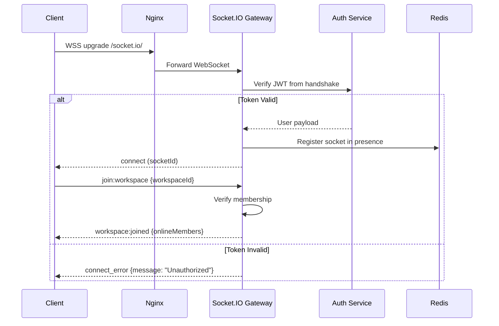
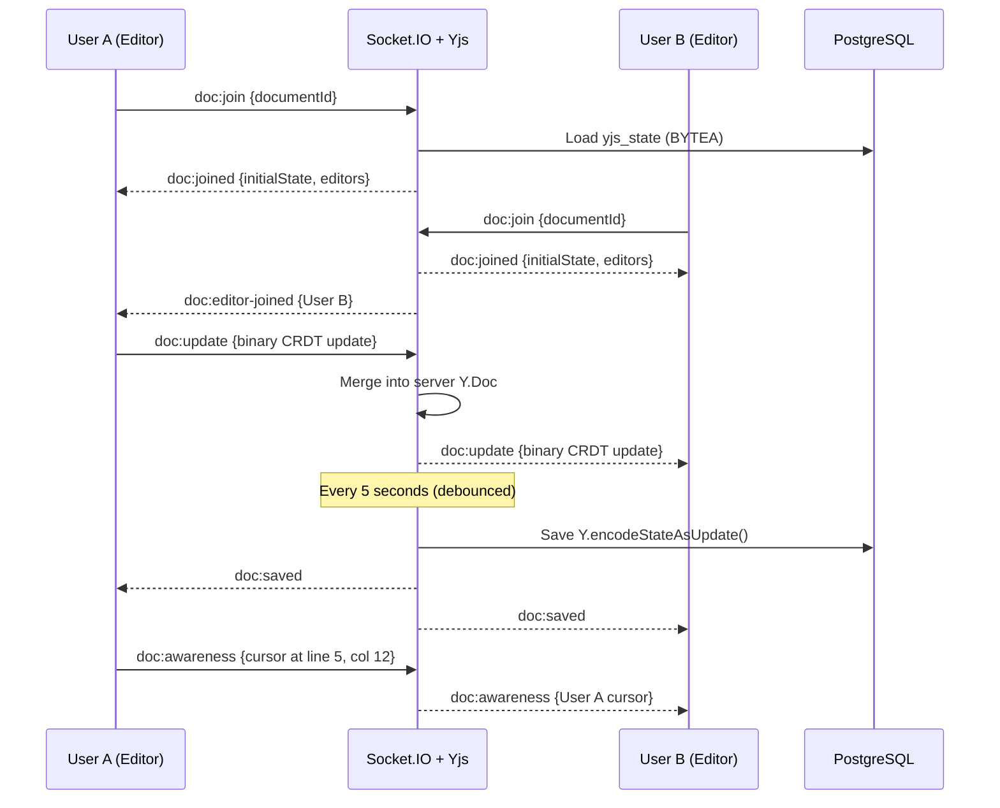

# 04 — WebSocket Events

## 1. Connection & Authentication

### Connection Flow



### Client Connection
The client initiates the connection by providing the access token in the handshake payload:
- **Transports**: `['websocket', 'polling']` (WebSocket primary, HTTP long-polling fallback for restricted proxies).
- **Handshake Auth**: `{ auth: { token: accessToken } }`.
- **Reconnection Policy**: Exponential backoff (1000ms base, 5000ms max, 10 attempts).

### Gateway Authentication & Lifecycle
1. **Token Extraction**: Reads the bearer JWT from `client.handshake.auth.token` or the `Authorization` header.
2. **Signature & Expiry Check**: Validates token authenticity using `JwtTokenService`.
3. **Revocation Check**: Queries the Redis JTI blacklist to ensure the session was not invalidated.
4. **Session Attachment**: Attaches the user payload to `client.data.user`.
5. **Private Room Subscription**: Automatically joins the user's private notification channel (`user:{userId}`).
6. **Error Containment**: Unauthenticated sockets receive a structured `error` event (`TOKEN_INVALID`) and are immediately disconnected.

---

## 2. Namespace & Room Architecture

```
Socket.IO Namespace: / (default)
│
├── Room: workspace:{workspaceId}
│   ├── All members of this workspace
│   └── Events: workspace-level notifications, member status
│
├── Room: board:{boardId}
│   ├── Users currently viewing this board
│   └── Events: card CRUD, list CRUD, card moves, board updates
│
├── Room: document:{documentId}
│   ├── Users currently editing this document
│   └── Events: Yjs CRDT updates, cursor positions, selection
│
└── Room: user:{userId}
    ├── Private room for the user (all their sockets)
    └── Events: notifications, cross-board updates
```

### Room Subscription Mechanics
- **Board Scoping (`board:join` / `board:leave`)**: When a client switches to a board, it emits `board:join { boardId }`. The gateway validates workspace membership through `WsBoardAccessGuard`, evicts the socket from any previously viewed board room, joins `board:{boardId}`, and notifies viewers via `board:presence`.
- **Automatic Teardown**: Upon socket disconnect or navigating away (`board:leave`), the server prunes room memberships, purges the user from the active presence set in Redis, and emits a departure event.

---

## 3. Event Catalog

### 3.1 Connection Events

| Event | Direction | Payload | Description |
|-------|-----------|---------|-------------|
| `connect` | S → C | `{ socketId }` | Connection established |
| `connect_error` | S → C | `{ message }` | Auth failed |
| `disconnect` | S → C | `{ reason }` | Connection dropped |
| `error` | S → C | `{ code, message }` | Runtime error |
| `token:expired` | S → C | `{}` | JWT expired, reconnect with fresh token |

### 3.2 Workspace Events

#### Client → Server

| Event | Payload | Description |
|-------|---------|-------------|
| `workspace:join` | `{ workspaceId }` | Join workspace room |
| `workspace:leave` | `{ workspaceId }` | Leave workspace room |

#### Server → Client

| Event | Payload | Description |
|-------|---------|-------------|
| `workspace:joined` | `{ workspaceId, onlineMembers: User[] }` | Successfully joined workspace room |
| `workspace:member-online` | `{ userId, displayName, avatarUrl }` | A member came online |
| `workspace:member-offline` | `{ userId }` | A member went offline |
| `workspace:member-added` | `{ member: WorkspaceMember }` | New member joined workspace |
| `workspace:member-removed` | `{ userId }` | Member removed from workspace |
| `workspace:updated` | `{ workspace: Partial<Workspace> }` | Workspace settings changed |

---

### 3.3 Board Events

#### Client → Server

| Event | Payload | Description |
|-------|---------|-------------|
| `board:join` | `{ boardId }` | Start viewing a board |
| `board:leave` | `{ boardId }` | Stop viewing a board |

#### Server → Client (broadcast to board room)

| Event | Payload | Description |
|-------|---------|-------------|
| `board:joined` | `{ boardId, viewers: User[] }` | Board room joined |
| `board:updated` | `{ boardId, changes: Partial<Board> }` | Board title/color changed |
| `board:archived` | `{ boardId, archivedBy }` | Board was archived |
| `board:unarchived` | `{ boardId, board: Board }` | Board was unarchived |
| `board:deleted` | `{ boardId, deletedBy }` | Board permanently deleted (direct or from archived) |
| `board:created` | `{ board: Board }` | New board created in workspace |
| **List events** | | |
| `list:created` | `{ list: List }` | New list added |
| `list:updated` | `{ listId, changes: Partial<List> }` | List title changed |
| `list:moved` | `{ listId, newRank }` | List reordered |
| `list:archived` | `{ listId, archivedBy }` | List archived |
| `list:unarchived` | `{ listId, list: List }` | List unarchived |
| `list:deleted` | `{ listId, deletedBy }` | List permanently deleted (direct or from archived) |
| **Card events** | | |
| `card:created` | `{ card: CardSummary }` | New card added |
| `card:updated` | `{ cardId, changes: Partial<Card> }` | Card fields changed |
| `card:moved` | `{ cardId, fromListId, toListId, newRank }` | Card moved |
| `card:archived` | `{ cardId, listId }` | Card archived |
| `card:unarchived` | `{ cardId, card: Card }` | Card unarchived |
| `card:deleted` | `{ cardId, listId, deletedBy }` | Card permanently deleted (direct or from archived) |
| `card:assignee-added` | `{ cardId, user: UserSummary }` | Member assigned to card |
| `card:assignee-removed` | `{ cardId, userId }` | Assignment removed |
| `card:comment-added` | `{ cardId, comment: Comment }` | New comment on card |
| `card:comment-updated` | `{ cardId, comment: Comment }` | Comment edited |
| `card:comment-deleted` | `{ cardId, commentId }` | Comment removed |
| `card:attachment-added` | `{ cardId, attachment: CardAttachment }` | Attachment uploaded to card |
| `card:attachment-deleted` | `{ cardId, attachmentId }` | Attachment removed from card |
| **Checklist events** | | |
| `checklist:created` | `{ cardId, checklist: Checklist }` | Checklist added to card |
| `checklist:updated` | `{ cardId, checklist: Checklist }` | Title changed / progress changed |
| `checklist:deleted` | `{ cardId, checklistId }` | Checklist removed |

### Board Event Payload Examples

```typescript
// card:moved — sent to all board viewers when any user drags a card
{
  cardId: "uuid-of-moved-card",
  fromListId: "uuid-todo-list",
  toListId: "uuid-in-progress-list",
  newRank: "g",  // Lexorank position in target list
  movedBy: {
    id: "uuid",
    displayName: "John Doe"
  }
}

// card:updated — partial update broadcast
{
  cardId: "uuid",
  changes: {
    title: "Updated card title",
    isComplete: true,
    updatedAt: "2026-08-08T12:00:00Z"
  },
  updatedBy: {
    id: "uuid",
    displayName: "John Doe"
  }
}
```

---

### 3.4 Presence Events

#### Client → Server

| Event | Payload | Description |
|-------|---------|-------------|
| `presence:heartbeat` | `{}` | Keep-alive (every 30s) |

#### Server → Client

| Event | Payload | Description |
|-------|---------|-------------|
| `board:presence` | `{ userId, action: 'joined'\|'left', displayName, avatarUrl }` | Board viewer change |
| `board:viewers` | `{ viewers: PresenceUser[] }` | Full viewer list (on join) |

```typescript
// PresenceUser shape
interface PresenceUser {
  userId: string;
  displayName: string;
  avatarUrl: string | null;
  color: string;       // Unique color assigned per session
  connectedAt: string;
}
```

<details>
<summary><strong>💡 How is presence tracked?</strong></summary>

**Redis-based Dual-Key Presence Architecture**:

```
1. Active Timestamps (Sorted Set):
   Key: presence:board:{boardId}:active
   Score: timestamp (last heartbeat in ms)
   Member: socketId

2. Metadata Dictionary (Hash):
   Key: presence:board:{boardId}:meta
   Field: socketId
   Value: JSON { userId, socketId, displayName, avatarUrl, color, connectedAt }

3. Active Boards Tracker (Set):
   Key: presence:active_boards
   Members: boardId
```

- **Heartbeat:** Client sends `presence:heartbeat` every 30s → server executes atomic $O(\log N)$ update: `zadd activeKey now socketId` without reading or parsing JSON!
- **Disconnect:** On socket disconnect, `removePresence` executes in $O(1)$ via atomic pipeline (`zrem` + `hget` + `hdel`). If remaining count is 0, board is removed from `presence:active_boards`.
- **Cleanup:** Background job (every 60s) scans only active boards in `presence:active_boards` and prunes sockets with timestamps older than 90s (missed 3 heartbeats).
- **Cross-server:** Synchronized across all NestJS nodes via the Redis adapter.

</details>

---

### 3.5 Document (Collaborative Editing) Events

#### Client → Server

| Event | Payload | Description |
|-------|---------|-------------|
| `doc:join` | `{ documentId }` | Start editing document |
| `doc:leave` | `{ documentId }` | Stop editing document |
| `doc:update` | `{ documentId, update: Uint8Array }` | Yjs CRDT update (binary) |
| `doc:awareness` | `{ documentId, awareness: Uint8Array }` | Cursor/selection state |

#### Server → Client

| Event | Payload | Description |
|-------|---------|-------------|
| `doc:joined` | `{ documentId, initialState: Uint8Array, editors: User[] }` | Document room joined with initial CRDT state |
| `doc:update` | `{ documentId, update: Uint8Array, origin: userId }` | CRDT update from another editor |
| `doc:awareness` | `{ documentId, awareness: Uint8Array }` | Another editor's cursor/selection |
| `doc:editor-joined` | `{ documentId, user: User }` | Another user started editing |
| `doc:editor-left` | `{ documentId, userId }` | A user stopped editing |
| `doc:saved` | `{ documentId, savedAt }` | Document persisted to DB |

### Document Sync Flow



<details>
<summary><strong>💡 Why send CRDT updates as binary (Uint8Array) over WebSocket?</strong></summary>

Yjs updates are natively binary-encoded. Sending as binary:
- **3-5x smaller** than JSON-encoded equivalent.
- **No serialization overhead** — Yjs produces and consumes binary directly.
- **Socket.IO supports binary** natively — no Base64 encoding needed.

The server maintains a `Y.Doc` instance per active document in memory. When a user joins, the server sends the full state. When updates arrive, the server merges them (CRDTs handle conflicts automatically) and broadcasts to other editors.

</details>

---

### 3.6 Notification Events

#### Server → Client (via user:{userId} room)

| Event | Payload | Description |
|-------|---------|-------------|
| `notification:new` | `Notification` (full row) | New notification persisted for this user |
| `notification:count` | `{ unreadCount: -1 }` | Stale hint, never a real count — client refetches `GET /notifications/unread-count` |

```typescript
// Notification payload
{
  id: "uuid",
  type: "card_assigned",
  title: "You were assigned to 'Implement JWT auth'",
  body: "John Doe assigned you to this card in Sprint 23",
  entityType: "card",
  entityId: "uuid",
  workspaceId: "uuid",
  createdAt: "2026-08-08T12:00:00Z"
}
```

---

## 4. Error Handling

### Error Event Format

```typescript
// Server → Client
{
  code: "BOARD_ACCESS_DENIED",
  message: "You don't have access to this board",
  event: "board:join",  // The event that caused the error
  timestamp: "2026-08-08T12:00:00.000Z"  // ISO 8601 timestamp of the error
}
```

### Error Codes

| Code | Description |
|------|-------------|
| `TOKEN_EXPIRED` | JWT expired — client should refresh and reconnect |
| `TOKEN_INVALID` | JWT is malformed or tampered |
| `BOARD_ACCESS_DENIED` | User is not a member of the board's workspace |
| `BOARD_NOT_FOUND` | Board doesn't exist or is archived |
| `DOCUMENT_ACCESS_DENIED` | User is not a member of the document's workspace |
| `DOCUMENT_NOT_FOUND` | Document doesn't exist or is archived |
| `RATE_LIMIT_EXCEEDED` | Too many events per second |
| `ROOM_ALREADY_JOINED` | Duplicate join request |
| `INVALID_PAYLOAD` | Event payload validation failed |

---

## 5. Reconnection & State Sync

### Client-Side Reconnection Strategy
- **Transport Disconnects**: Socket.IO automatically attempts reconnection with exponential backoff (1s to 5s delay). Upon re-establishing the connection, the client re-emits room join events (`workspace:join`, `board:join`, `doc:join`).
- **Server-Forced Disconnects**: If disconnected by the server (`io server disconnect`, e.g., expired token), the client calls `POST /api/auth/refresh` to obtain a fresh access token before reconnecting.

### Server-Side State Reconciliation
- **Boards**: On reconnecting, the client refetches the latest board state via REST (`GET /api/boards/:id`) while resuming real-time delta events.
- **Documents (CRDT)**: Handled seamlessly by Yjs. The client sends its local state vector upon joining, and the server returns only missing updates, guaranteeing conflict-free reconciliation.

---

## 6. Rate Limiting (WebSocket)

Sliding-window limits per user per event category, enforced in Redis. Document awareness streams
need high rates to feel smooth; clients should additionally **throttle locally** so the server caps are rarely hit.

| Event Category | Limit | Window |
|---------------|-------|--------|
| `board:*` state events | 60 events | per minute |
| Room joins (`*:join`) | 10 events | per minute |
| `doc:update` | 120 events | per minute |
| `doc:awareness` | 600 events (10/s) | per minute |

> [!NOTE]
> Rate limiter behavior: **fail-open** on Redis pipeline errors (prioritizing availability).

### Sliding-Window Algorithm (Redis ZSET)
Rate limits are enforced atomically via Redis pipelines using Sorted Sets (`ratelimit:ws:{userId}:{event}`):
1. **Prune**: `ZREMRANGEBYSCORE key 0 (now - windowMs)` evicts timestamps older than the sliding window.
2. **Record**: `ZADD key now uniqueEntry` logs the current timestamp.
3. **Count**: `ZCARD key` retrieves the number of events in the active window.
4. **Expire**: `EXPIRE key (windowMs / 1000)` sets key TTL to prevent orphaned data.
5. **Evaluate**: If `count <= limit`, execution proceeds; otherwise, a `RATE_LIMIT_EXCEEDED` error is emitted.

---

## 7. Card Enrichment broadcasts (room `board:{boardId}`)

Card enrichment events reuse the board rate limits above.

| WS event | Trigger | Payload |
|----------|---------|---------|
| `card:priority_changed` | `PATCH cards/:id/priority` | `{ cardId, boardId, from: lowest\|low\|medium\|high\|urgent, to, changedBy, updatedAt }` |
| `card:status_changed` | `PATCH cards/:id/status` (or legacy `isComplete` map) | `{ cardId, boardId, from: not_started\|active\|done\|closed, to, isComplete, changedBy, updatedAt }` |
| `card:link_created` | `POST cards/:id/links` | `{ link: { id, fromCardId, toCardId, type }, boardId }` |
| `card:link_deleted` | `DELETE cards/:id/links/:linkId` | `{ linkId, fromCardId, toCardId, boardId }` |
| `card:subcard_created` | create/attach/promote subcard | `{ parentId, card, boardId }` (plus standard `card:created`) |
| `card:time_logged` | `POST cards/:id/time` | `{ cardId, boardId, minutes, loggedTotal, entryId }` |
| `comment:created` (extended) | reply created | existing shape; `comment.parentCommentId?: string \| null` (thread via REST) |

Priority colors: lowest `#6B7280`, low `#3B82F6`, medium `#F59E0B`, high `#EF4444`,
urgent `#991B1B`. Status colors: not_started `#6B7280`, active `#3B82F6`,
done `#22C55E`, closed `#111827`.
