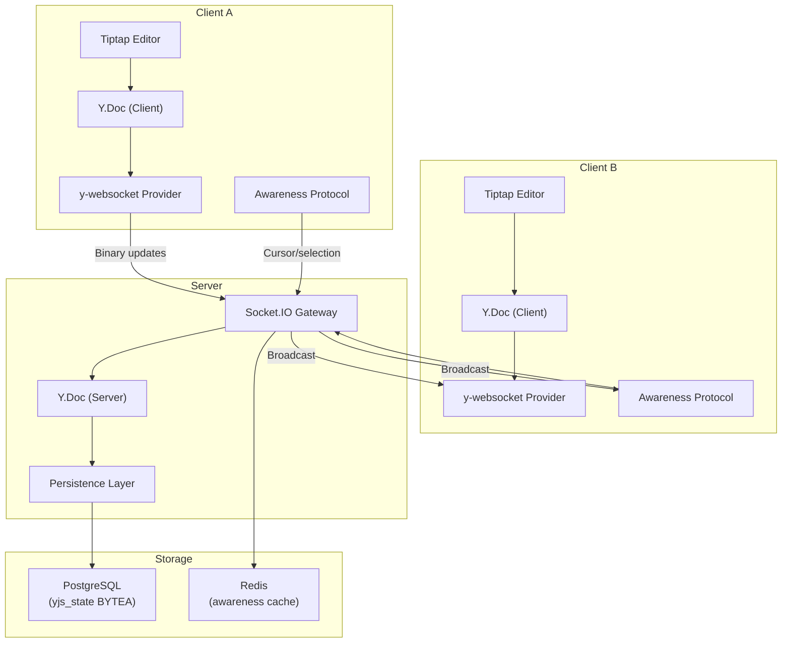
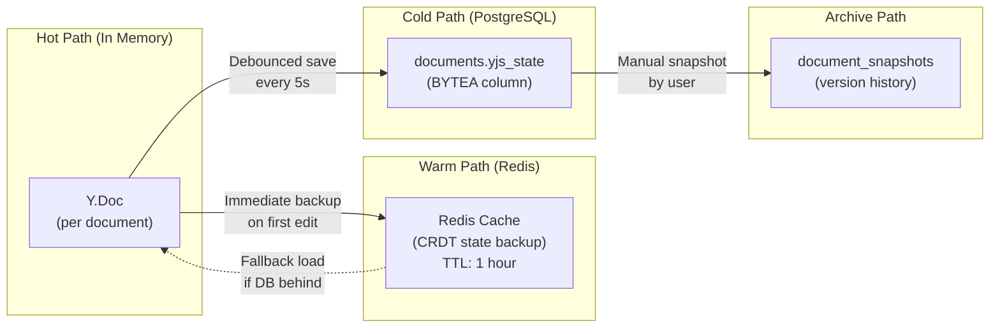

# 05 — Real-Time Engine Design

## 1. Architecture Decision: CRDT with Yjs

### OT vs CRDT Comparison

| Aspect | OT (Operational Transformation) | CRDT (Yjs) |
|--------|-------------------------------|------------|
| **Complexity** | Very high — must implement transform functions for every operation pair | Moderate — library handles conflict resolution |
| **Central server** | Required — server is the source of truth and transforms ops | Optional — peers can sync directly |
| **Conflict resolution** | Manual — you write transformation logic | Automatic — mathematically guaranteed convergence |
| **Libraries** | ShareDB (maintained but complex) | Yjs (actively maintained, 12k+ GitHub stars) |
| **Offline support** | Difficult — need to queue and replay ops | Native — CRDT state merges cleanly after reconnect |
| **Rich-text editors** | ShareDB + Quill | Yjs + Tiptap/ProseMirror, CodeMirror, Monaco |
| **Performance** | Good for small documents | Excellent — Yjs is the fastest CRDT implementation |
| **Learning value** | High (Google Docs approach) | High (modern distributed systems approach) |

<details>
<summary><strong>💡 Why we chose CRDT (Yjs) for SyncBoard</strong></summary>

1. **Yjs handles the hard parts** — Conflict resolution, state merging, and document encoding are handled by the library. We focus on transport (WebSocket) and persistence (PostgreSQL).
2. **Tiptap integration** — Tiptap (ProseMirror-based) has first-class Yjs support via `@tiptap/extension-collaboration`. This gives us rich-text editing with CRDT for free.
3. **Offline resilience** — CRDTs merge state from any point in time. A user who goes offline for hours can rejoin and their edits merge without conflicts.
4. **No custom transform functions** — OT requires writing and testing O(n²) transformation functions for every operation pair (insert×insert, insert×delete, etc.). One bug = data corruption.

</details>

---

## 2. Yjs Architecture

### System Overview



### How CRDTs Work (Simplified)

```
Traditional (last-write-wins):
  User A types "Hello " at position 0
  User B types "World" at position 0
  Result: "World" (User A's edit is lost!)

CRDT (Yjs):
  User A inserts "Hello " with unique ID (A, clock:1)
  User B inserts "World" with unique ID (B, clock:1)
  Yjs sorts by ID → deterministic merge
  Result: "Hello World" (both edits preserved!)

Even more complex:
  User A: "Hello |World" → adds "Beautiful " at position 6
  User B: "Hello World|" → adds "!" at position 11
  Concurrent, no conflict:
  Result: "Hello Beautiful World!"
```

<details>
<summary><strong>💡 Deeper: How Yjs Y.Text works internally</strong></summary>

Yjs uses a **YATA (Yet Another Transformation Approach)** CRDT for text:

1. Each character has a unique ID: `(clientId, clock)`.
2. Each character points to its **left origin** and **right origin** — the characters it was between when inserted.
3. When merging concurrent inserts at the same position, Yjs uses client ID to deterministically order them.
4. Deletions are **tombstones** — marked as deleted but not removed, so concurrent operations can still reference them.

This means:
- **No transform functions** — just merge state.
- **No central server needed** — any two Y.Doc instances can sync.
- **Commutative and idempotent** — applying the same update twice is safe.

Trade-off: Tombstones accumulate over time. Yjs uses **garbage collection** to clean them up when all clients have seen the deletion.

</details>

---

## 3. Server-Side Implementation & Architecture

### 3.1 In-Memory Document Lifecycle

SyncBoard maintains active document instances in memory while collaborators are connected, persisting binary state deltas back to PostgreSQL on a debounced schedule:

```
[Client Edits] ──Socket.IO──> [In-Memory Y.Doc] ──5s Debounce──> [PostgreSQL BYTEA]
                                    │
                              [Idle > 5m] ──Flush & Destroy──> [Memory Freed]
```

#### Lifecycle State & Memory Management
* **Active Document Registry**: Tracks the live `Y.Doc`, active socket connection IDs, last activity timestamp, dirty flag, and pending persistence timer.
* **On-Demand Hydration (`getOrLoadDocument`)**: If already loaded, returns the existing in-memory `Y.Doc`. Otherwise, initializes a new `Y.Doc`, fetches the binary `yjsState` from PostgreSQL, and applies the initial state.
* **Debounced Persistence (`scheduleSave`)**:
  - Resets a 5-second timer on every edit (`SAVE_DEBOUNCE_MS = 5000`) to batch rapid typing into a single database write.
  - Serializes the in-memory document via `Y.encodeStateAsUpdate()` and saves to PostgreSQL `documents.yjs_state` (`BYTEA`).
  - Extracts the first 20,000 characters of `Y.Text` into `previewText` for PostgreSQL GIN full-text search without runtime deserialization overhead.
* **Idle Cleanup (`unloadIdleDocuments`)**: Periodic task checks for documents with 0 active connections. If inactive for > 5 minutes (`IDLE_TIMEOUT_MS = 300000`), it flushes pending writes, calls `ydoc.destroy()`, and purges the document from memory.
* **Process Teardown (`onModuleDestroy`)**: On server termination, all dirty documents are guaranteed to flush to PostgreSQL before the process exits.

<details>
<summary><strong>💡 Why keep Y.Doc in memory instead of replaying from DB each time?</strong></summary>

Each CRDT update is a compact binary delta. To apply an update, the server needs the active document state in memory. Loading and deserializing `BYTEA` from the database on every single keystroke would introduce severe I/O bottlenecks and race conditions. By maintaining the `Y.Doc` in memory, updates apply in microseconds, with periodic background flushes to PostgreSQL ensuring persistence.

</details>

---

### 3.2 WebSocket Document Relay

The `DocumentGateway` manages real-time socket connections, room multiplexing, and binary update broadcasting:

| Event | Direction | Action & Algorithm |
|---|---|---|
| `doc:join` | Client $\to$ Server | 1. Verifies workspace membership.<br/>2. Loads or retrieves the in-memory `Y.Doc`.<br/>3. Joins Socket.IO room `document:${documentId}`.<br/>4. Emits `doc:joined` with state vector diff and active collaborator list.<br/>5. Broadcasts `doc:editor-joined` to other room members. |
| `doc:update` | Client $\to$ Server | 1. Applies binary update delta to the server's `Y.Doc` (automatic CRDT merge).<br/>2. Marks document dirty and triggers 5s debounce save.<br/>3. Broadcasts `doc:update` binary payload to all peers in the room. |
| `doc:awareness` | Client $\to$ Server | Ephemeral relay: broadcasts cursor position and selection state to room peers without database writes. |
| `doc:leave` | Client $\to$ Server | Leaves socket room, decrements active connection count, notifies peers (`doc:editor-left`), and triggers idle timer. |

---

## 4. Awareness Protocol (Cursors & Selection)

### What is Awareness?

The **awareness protocol** broadcasts ephemeral user state that should not be persisted to storage:
* Cursor position (Yjs relative index anchored to document content)
* Active text selection ranges
* Collaborator profile metadata (display name, avatar, and assigned cursor color)
* Online / active status

### Awareness State Structure

```typescript
interface AwarenessState {
  user: {
    name: string;
    color: string;      // Unique collaborator color
    avatarUrl: string;
  };
  cursor: {
    anchor: number;     // Yjs relative position
    head: number;       // Selection end
  } | null;
}
```

### Color Assignment Algorithm

To ensure visual distinction between concurrent editors:
1. **Deterministic Hashing**: User IDs are hashed to select a primary color from a curated 12-color high-contrast palette.
2. **Collision Resolution**: If an active room collaborator already holds the hashed color, the algorithm walks the palette to assign the next available color slot.

---

## 5. Conflict Resolution Deep Dive

### Scenario 1: Concurrent Text Insertion

```
Document state: "Hello World"
                     ^
                     position 5

User A (offline) types " Beautiful" at position 5
User B (online)  types " Cruel" at position 5

User A reconnects:
  A's update: insert " Beautiful" at position 5 (relative to "Hello" and " World")
  B's update: insert " Cruel" at position 5 (relative to "Hello" and " World")

Yjs CRDT merge:
  Both insertions reference the same left/right origins
  Yjs uses client ID ordering for deterministic placement
  Result: "Hello Beautiful Cruel World" or "Hello Cruel Beautiful World"
  (Consistent across ALL clients — that's the CRDT guarantee)
```

### Scenario 2: Concurrent Deletion + Edit

```
Document: "Hello World"

User A: Deletes "World" (positions 6-10)
User B: Changes "World" to "World!" (inserts "!" at position 11)

Yjs merge:
  "World" is tombstoned (marked deleted)
  "!" was inserted after "d" of "World" (by reference)
  Since "World" is deleted, "!" appears after the deletion point
  Result: "Hello !"

  This is the mathematically correct CRDT behavior.
  The "!" survives because it was a new insertion, not part of the deleted range.
```

### Scenario 3: Concurrent Card Moves on Board

```
Board has: List A [Card 1, Card 2, Card 3], List B []

User A: Moves Card 2 from List A to List B
User B: Moves Card 2 to position 1 in List A (reorder)

This is NOT handled by CRDT — it's application-level logic.
Resolution: Last-write-wins with conflict notification.

Server receives A's move first → Card 2 moves to List B
Server receives B's move → Card 2 is no longer in List A!
  → Server applies B's move (moves Card 2 back to List A, position 1)
  → Broadcast updated state
  → User A sees card "jump" back and gets a toast: "Card 2 was moved by User B"
```

---

## 6. Horizontal Scaling with Redis Adapter

### Single Server (Development)

```
Client A ──┐
Client B ──┤── Socket.IO Server ──┤── Y.Doc (memory)
Client C ──┘                       └── PostgreSQL
```

### Multiple Servers (Production)

```
Client A ──── Server 1 ────┐
Client B ──── Server 1     │
                           ├── Redis Pub/Sub ── Shared State
Client C ──── Server 2     │
Client D ──── Server 2 ────┘

When Server 1 receives an update from Client A:
  1. Apply to Server 1's local Y.Doc
  2. Broadcast to Client B (local)
  3. Publish to Redis Pub/Sub
  4. Server 2 receives from Redis
  5. Broadcast to Client C, Client D
```

### Redis Adapter Setup

The application uses a custom `RedisIoAdapter`. It duplicates the shared Redis
service into dedicated pub/sub connections and is registered in `main.ts`:

```typescript
// main.ts (excerpt)
const redisIoAdapter = new RedisIoAdapter(app);
await redisIoAdapter.connectToRedis();
app.useWebSocketAdapter(redisIoAdapter);
```

---

## 7. Performance Envelope & Limits

| Metric | Design envelope | Notes |
|--------|--------|-------|
| **Update latency** | < 50ms | Time from User A keystroke to User B seeing it |
| **Max concurrent editors per doc** | 50 | Awareness broadcasts grow linearly |
| **Max document size** | 5 MB (CRDT state) | ~500 pages of rich text |
| **Save debounce** | 5 seconds | Configurable per deployment |
| **Idle unload** | 5 minutes | Free memory for inactive documents |
| **Awareness update rate** | Max 10/sec per client | Rate-limited to prevent flooding |

### Memory Usage Estimate

```
Per active document:
  Y.Doc base:        ~50 KB
  Average content:    ~200 KB
  Awareness state:    ~1 KB per editor
  Total per doc:      ~250 KB

With 100 active documents: ~25 MB
With 500 active documents: ~125 MB

Node.js default heap: 1.5 GB → comfortable headroom
```

---

## 8. Persistence Strategy



Our debounced approach batches rapid edits (typing) into single saves while still persisting within 5 seconds of any change.

---

## 9. Yjs API Traceability

SyncBoard integrates **Yjs 13.6** directly with Socket.IO and PostgreSQL BYTEA storage:

| Yjs README Section | Used APIs | Where Implemented |
|---|---|---|
| **Shared Types (`Y.Doc`, `Y.Text`)** | `new Y.Doc()`, `ydoc.getText('content')`, `toString()`, `on('update')`, `gc=true`, `destroy()` | `document-manager.service.ts`, `yjs-helpers.ts` |
| **Document Updates & State Vectors** | `applyUpdate`, `encodeStateAsUpdate`, `encodeStateVector`, `mergeUpdates`, `diffUpdate`, `applyUpdateV2` | `document-manager.service.ts`, `document.gateway.ts` |
| **Relative Positions** | `createRelativePositionFromTypeIndex`, `resolveRelativePosition` | `yjs-helpers.ts` (comment anchoring) |
| **Undo / Redo** | `createUndoManager` (wraps `ydoc.getText('content')`) | Client-only (`yjs-helpers.ts`); server relies on `DocumentSnapshot` |
| **CRDT Algorithm & Garbage Collection** | `doc.gc = true` for struct merging and tombstone pruning | `document-manager.service.ts` |
| **Bindings & Providers** | Deliberately omitted (`y-websocket`, `Hocuspocus`) | Replaced by `Socket.IO + RedisIoAdapter` and workspace auth |

### End-to-End CRDT Lifecycle

```
Client edit → Y.Text('content').insert → Y.encodeStateAsUpdate → Socket.IO doc:update
            → Server DocumentManager.applyUpdate → Y.applyUpdate(live Y.Doc) → broadcast to room
            → Peers Y.applyUpdate → convergence across clients
            → Debounced (5s) → Y.encodeStateAsUpdate → Buffer.from → documents.yjs_state (PostgreSQL BYTEA)
            → previewText = Y.Text.toString().slice(0, 20000) → indexed for full-text search

Join Room   → Client sends stateVector with doc:join
            → Server encodes diff: Y.encodeStateAsUpdate(ydoc, vector) → returns minimal delta
```
