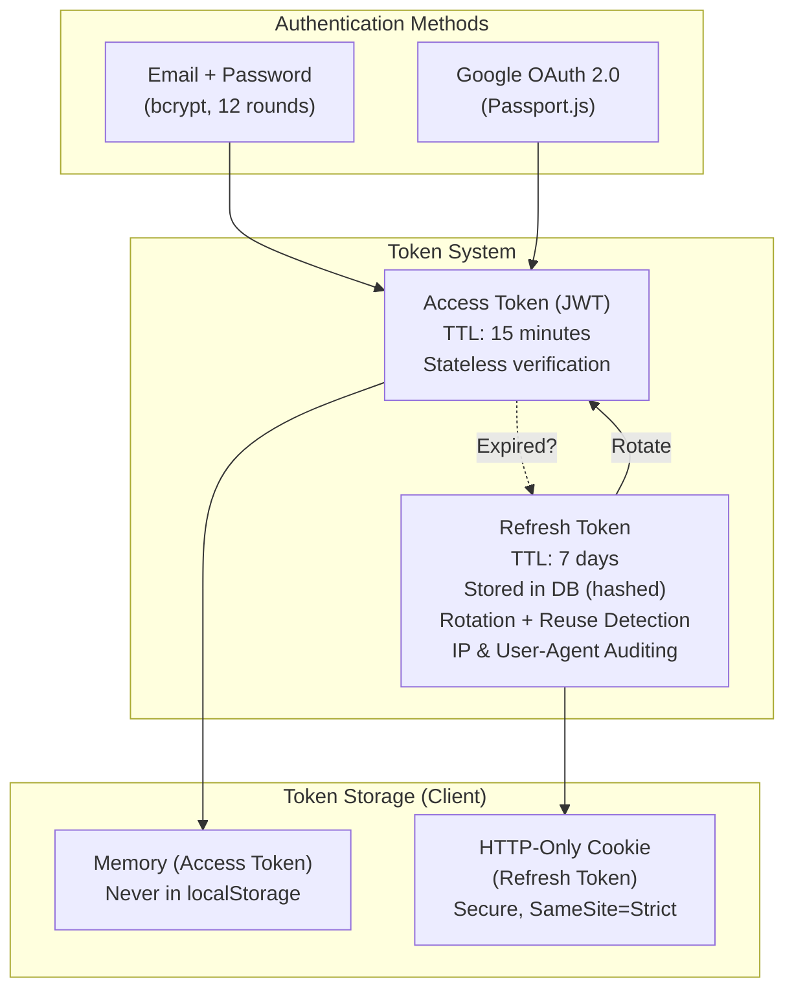
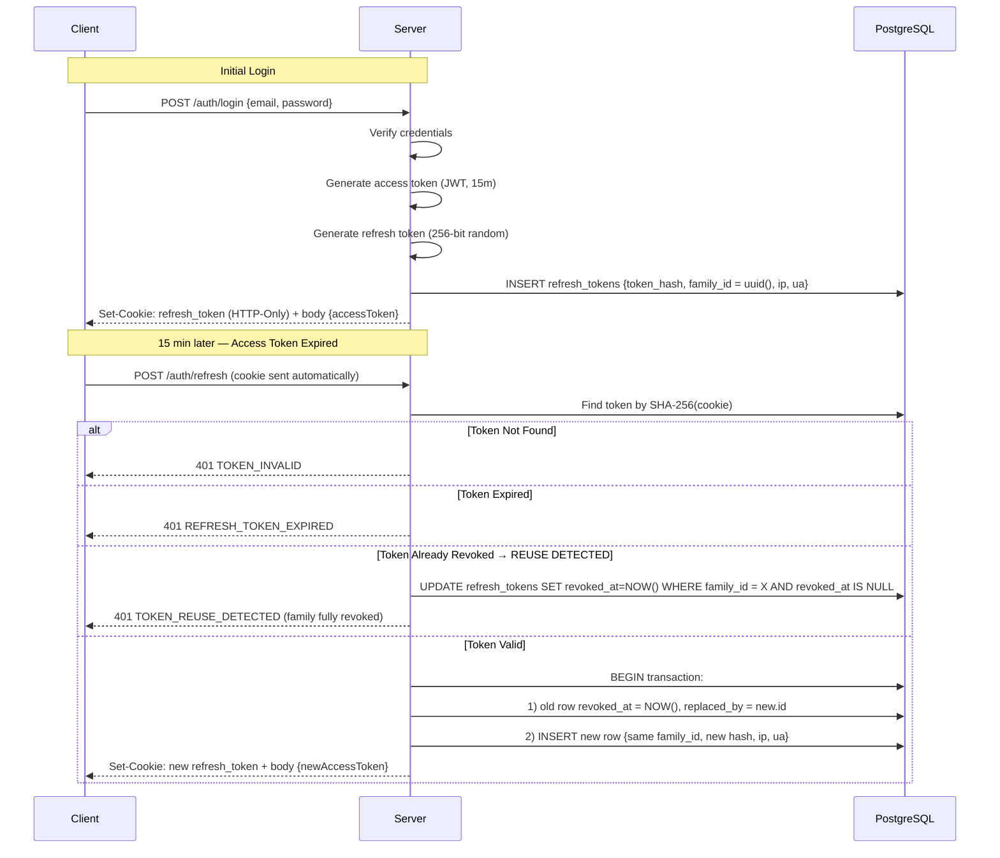
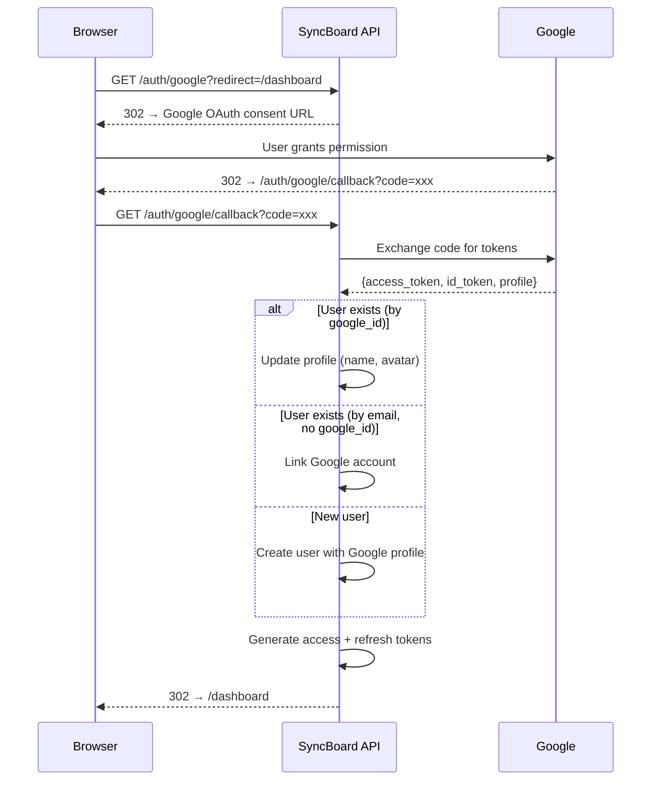

# 06 — Auth & RBAC Design

## 1. Authentication Strategy Overview



---

## 2. JWT Access Token

### Token Structure

```json
// Header
{
  "alg": "RS256",
  "typ": "JWT",
  "kid": "key-2026-08"
}

// Payload
{
  "sub": "user-uuid",
  "email": "user@example.com",
  "displayName": "John Doe",
  "avatarUrl": "https://example.com/avatar.png",
  "isEmailVerified": false,
  "iat": 1723104000,
  "exp": 1723104900,
  "iss": "syncboard",
  "jti": "unique-token-id"
}
```

<details>
<summary><strong>💡 Why RS256 (asymmetric) over HS256 (symmetric)?</strong></summary>

**HS256:** Single shared secret signs AND verifies. If any service has the secret, it can forge tokens.

**RS256:** Private key signs, public key verifies. Only the auth service needs the private key. Other services/microservices (if we ever extract them) only need the public key to verify.

- **Current benefit:** Key rotation — you can deploy a new key pair without downtime by supporting multiple `kid` values.
- **Scaling benefit:** verification needs only the public key, so any service can verify tokens without holding the signing key.

</details>

### Access Token Configuration

```typescript
// Auth constants (illustrative)
export const AUTH_CONFIG = {
  accessToken: {
    algorithm: 'RS256' as const,
    expiresIn: '15m',           // Short-lived
    issuer: 'syncboard',
  },
  refreshToken: {
    expiresInDays: 7,           // Long-lived
    reuseDetection: true,       // Replay of a revoked token revokes its whole family
  },
  password: {
    bcryptRounds: 12,
    minLength: 8,
    maxLength: 128,
  },
  rateLimit: {
    loginAttempts: 5,           // Per IP per minute
    registerAttempts: 3,        // Per IP per minute
    refreshAttempts: 10,        // Per user per minute
    passwordResetAttempts: 3,   // Per IP per hour
  },
};
```

### Token Issuance & Verification Architecture

SyncBoard separates cryptographic signing from stateless verification using RS256 asymmetric keys:

* **Signing Authority**: Access tokens (15-minute TTL) are minted using the RSA private key (`JWT_PRIVATE_KEY_PATH`). Each token is stamped with an immutable subject (`sub: userId`), user profile claims, and a unique `jti` (UUID).
* **Stateless Edge Verification**: `JwtAuthGuard` validates inbound tokens against the RSA public key (`JWT_PUBLIC_KEY_PATH`). Because signature validation requires no database I/O, REST endpoints achieve sub-millisecond authentication overhead.
* **Instant Blacklist Checks**: Before passing the request down to domain controllers, the guard performs an $O(1)$ check against the Redis token blacklist (`blacklist:jti:<jti>`). If a user logs out or terminates all sessions, their token is immediately blocked for its remaining lifespan.

---

## 3. Refresh Token System

### Refresh Token Rotation Flow

Every refresh **rotates** the token: the presented token is revoked immediately, a new row is
inserted in the same `family_id`, and the successor is linked via `replaced_by`. Replaying an
already-revoked token is treated as theft — the entire family is revoked.



<details>
<summary><strong>💡 Why rotate into a new row instead of updating in place?</strong></summary>

In-place updates are simpler but **cannot detect token theft**: overwriting the hash destroys
the only evidence that the old token was ever issued. With explicit chains (`family_id` +
`revoked_at`), a replayed predecessor proves two parties hold the same session — the standard
signal to nuke the whole family (Auth0-style rotation).

Cost: one extra row per refresh. Mitigated by the cleanup cron deleting rows expired/revoked
more than 30 days ago (`idx_refresh_tokens_cleanup`).

</details>

### Refresh Token Cookie Contract

| Property | Value | Why |
|----------|-------|-----|
| Name | `refreshToken` | Single well-known name |
| `HttpOnly` | ✅ | Inaccessible to JavaScript (XSS defense) |
| `Secure` | ✅ in production | Never sent over plain HTTP |
| `SameSite` | `Lax` | Blocks cross-site POSTs; allows top-level navigation carries — adequate for a same-site client and API. `Strict` is the tighter option when frontend and API share one origin |
| `Path` | `/api/auth` | Only auth endpoints ever need it |
| `Max-Age` | 7 days (= refresh TTL) | Browser auto-expires with the session |

With `SameSite=Lax`, classic CSRF POSTs from foreign origins do not carry the cookie, so no
CSRF token is required for `/auth/refresh|logout`. A cross-origin SPA client would
add a double-submit CSRF token alongside the cookie.

---

## 4. Google OAuth 2.0

### OAuth Flow



### Account Linking & Identity Resolution

When Google returns verified profile claims (`googleId`, `email`, `displayName`, `avatarUrl`), the `AuthService` applies deterministic account resolution:
1. **Existing Google Account**: If `google_id` matches an existing user, logs in and updates profile metadata.
2. **Email Match & Account Linking**: If an account exists with the same email (created via email/password), automatically links the `google_id` and marks `is_email_verified = true`.
3. **New User Provisioning**: If no user exists, creates a new user record with `is_email_verified = true`, then issues the access token and set-cookie headers.

---

## 5. RBAC (Role-Based Access Control)

### Role Hierarchy

```
owner (full control)
  └── admin (manage members, settings)
        └── member (create/edit content)
              └── viewer (read-only access)
```

### Permission Matrix

| Action | Owner | Admin | Member | Viewer |
|--------|:-----:|:-----:|:------:|:------:|
| **Workspace** | | | | |
| View workspace | ✅ | ✅ | ✅ | ✅ |
| Edit workspace settings | ✅ | ✅ | ❌ | ❌ |
| Delete workspace | ✅ | ❌ | ❌ | ❌ |
| Transfer ownership | ✅ | ❌ | ❌ | ❌ |
| Leave workspace | 🔶*** | ✅ | ✅ | ✅ |
| **Members** | | | | |
| Invite members | ✅ | ✅ | ❌ | ❌ |
| Remove members | ✅ | ✅ | ❌ | ❌ |
| Change member roles | ✅ | ✅* | ❌ | ❌ |
| **Boards** | | | | |
| Create board | ✅ | ✅ | ✅ | ❌ |
| Edit board | ✅ | ✅ | ✅ | ❌ |
| Archive board | ✅ | ✅ | ❌ | ❌ |
| View board | ✅ | ✅ | ✅ | ✅ |
| Star/Unstar board (personal) | ✅ | ✅ | ✅ | ✅ |
| **Cards** | | | | |
| Create/edit cards | ✅ | ✅ | ✅ | ❌ |
| Move cards | ✅ | ✅ | ✅ | ❌ |
| Archive cards | ✅ | ✅ | ❌ | ❌ |
| Comment on cards | ✅ | ✅ | ✅ | ❌ |
| **Documents** | | | | |
| Create document | ✅ | ✅ | ✅ | ❌ |
| View / Search documents | ✅ | ✅ | ✅ | ✅ |
| Live real-time edit (CRDT) | ✅ | ✅ | ✅ | ❌ |
| Rename document | ✅ | ✅ | ✅ | ❌ |
| Create snapshot | ✅ | ✅ | ✅ | ❌ |
| Restore snapshot | ✅ | ✅ | ❌ | ❌ |
| Archive document | ✅ | ✅ | ✅ | ❌ |
| **Files** | | | | |
| Upload files | ✅ | ✅ | ✅ | ❌ |
| Delete files | ✅ | ✅ | 🔶** | ❌ |

\* Admin can change roles to member/viewer only, cannot promote to admin/owner.  
\** Member can only delete their own uploaded files.  
\*** Sole owner must transfer ownership before leaving.

## 6. Email Verification

### Why Email Verification Exists

Email verification proves that the account owner controls the mailbox behind
their address. SyncBoard relies on this in three places:

1. **Account recovery** — password-reset emails must reach the real owner, not a typo'd or hostile mailbox.
2. **Collaboration trust** — workspace invitations reference users by email; a verified address keeps the invite/notification channel spam-free.
3. **Abuse deterrence** — bots and throwaway accounts can still register, but cannot create workspaces, spam invitations, or write content until a human confirms the mailbox.

Verification is **one-way and irreversible** (`is_email_verified` only flips
`false → true`). Google OAuth users skip the flow entirely — their provider
has already verified the address.

### Capability Matrix (Soft Gate)

Unverified users can log in and browse (read-only), but every mutating
request requires verification:

| Capability | Unverified | Verified |
|---|---|---|
| Log in / refresh / logout | ✅ | ✅ |
| `GET /auth/me`, `PATCH /auth/me`, resend verification | ✅ | ✅ |
| Read workspaces, boards, cards (GET requests) | ✅ | ✅ |
| Accept a workspace invitation | ✅ | ✅ |
| Create workspace, invite members, manage members | ❌ 403 | ✅ |
| Create/edit boards, lists, cards, comments, labels, checklists | ❌ 403 | ✅ |
| Upload attachments / file operations | ❌ 403 | ✅ |
| WebSocket realtime participation | ❌ blocked | ✅ |
| Google OAuth users | — | always verified |

Error contract: gated requests fail with **`403` / `EMAIL_NOT_VERIFIED`** so
the frontend can show a "verify your email" banner.

### Implementation

```text
Register ──> single-use token (Redis, 24h TTL)
        ──> welcome-verify email (link: {CLIENT_URL}/verify-email?token=...)
        ──> POST /auth/verify-email  (public, no session required; atomic consumption)
        ──> users.is_email_verified = true
        ──> event user.email_verified → confirmation email
```

- **Tokens** live in Redis, not Postgres: 24h TTL, single use, only a hash is stored.
- **Resend**: `POST /auth/resend-verification` (authenticated) issues a fresh token; `422 EMAIL_ALREADY_VERIFIED` if already verified.
- **JWT claim**: access tokens carry `isEmailVerified`. Because tokens are not re-issued on verification, `EmailVerifiedGuard` re-checks the database when the claim is `false` (positive results cached in Redis for 5 min), so verification takes effect immediately without re-login.

### Guard Chain

| Guard | Purpose |
|---|---|
| `JwtAuthGuard` | Token signature, expiry, Redis blacklist |
| `EmailVerifiedGuard` | Soft gate: allows read-only (GET/HEAD/OPTIONS) + `@SkipEmailVerification()` endpoints; blocks other mutations with 403 `EMAIL_NOT_VERIFIED` for unverified users |
| `WorkspaceMemberGuard` / `RbacGuard` | Membership + role checks (unchanged) |
| `WsAuthGuard` | Rejects WebSocket events with `EMAIL_NOT_VERIFIED` when the socket user's claim is explicitly `false` |

`EmailVerifiedGuard` runs after `JwtAuthGuard` (it reads `request.user`) and is
applied automatically inside the `@WorkspaceAuth()` composition and explicitly
on `POST /workspaces`. Endpoints that must stay usable pre-verification are
marked `@SkipEmailVerification()` (e.g. invitation acceptance).

---

## 7. Password Security & Recovery

### Password Policy & Requirements
Enforced strictly during registration and password change:
- **Length**: 8 to 128 characters.
- **Complexity**: At least one lowercase letter, one uppercase letter, one digit, and one special character (`[!@#$%^&*]`).
- **Display Name**: 2 to 100 characters, trimmed.
- **Email**: Standard RFC 5322 email format, maximum 255 characters.

### Password Change & Session Revocation

When a user changes their password:
1. **All existing refresh token families are revoked** (`revokeAllByUserId`) across all devices to terminate stale sessions and prevent unauthorized access.
2. **The old access token (`jti`) is blacklisted** in Redis for its remaining TTL.
3. **A fresh token pair is issued** to the caller and the refresh token cookie is updated, keeping the current session seamlessly active while logging out all other devices.

### Password Reset Tokens

> [!NOTE]
> Reset tokens are stored in **Redis**, keyed by token hash → `userId`, TTL 1 hour,
> consumed atomically on use. The `password_reset_tokens` table in
> `02-database-design.md` documents the relational alternative for deployments that
> require persistent audit trails — pick one backing store.

Rules:
- Raw token is a 256-bit random value; only its SHA-256 hash appears in the key.
- Single-use: atomic get-and-delete on consumption; a used or expired token is rejected with `TOKEN_INVALID`.
- TTL: **1 hour** (`AUTH_CONFIG.passwordReset.expiresInSeconds`).
- A successful reset also revokes every refresh token family of that user and issues a fresh pair.
- No cleanup job needed — Redis TTL expires unused keys automatically.

<details>
<summary><strong>💡 Why not reuse refresh_tokens for reset tokens?</strong></summary>

Mixing concerns breaks invariants silently: the session cleanup job could delete an
outstanding reset token; reuse detection would treat a legitimate retry as theft and revoke
sessions; auditing "active device sessions" would count password-reset requests. Separate
tables keep TTLs, lifecycles, and queries independent.

</details>

<details>
<summary><strong>💡 Stale JWT claims (displayName/avatarUrl)</strong></summary>

The access token carries `displayName`, so profile edits take up to **15 minutes** (access
TTL) to appear in tokens already issued. This is accepted by design — clients should render
profile data from `GET /auth/me`, not from the decoded JWT. Role/authorization data is never
embedded in the JWT for exactly this reason: membership is checked per-request against the
database.

</details>

---

## 8. JWT Blacklisting (Logout)

- **Revocation Storage**: On single-device logout, all-device revocation, or password modification, the unique JWT identifier (`jti`) is persisted in Redis under `blacklist:{jti}` with a time-to-live (`TTL`) matched to the remaining access token lifetime.
- **Request Gate**: `JwtAuthGuard` performs an $O(1)$ key lookup against Redis for every authenticated request. If the token's `jti` exists in the blacklist, execution is halted with `401 Unauthorized ('Token has been revoked')`.
- **Automatic Eviction**: Once a token naturally passes its 15-minute expiration timestamp, Redis automatically evicts the entry, preventing unbounded memory growth.

<details>
<summary><strong>💡 Why Redis for blacklisting instead of a database table?</strong></summary>

- **Speed:** Every authenticated request checks the blacklist. Redis GET is ~0.1ms, PostgreSQL SELECT is ~1-5ms.
- **Auto-cleanup:** Redis TTL automatically removes expired blacklist entries. No cleanup job needed.
- **Memory-efficient:** With 15-min token TTL, the blacklist at any moment contains at most ~15 minutes worth of logout events. Even with 10,000 active users, that's a few KB.

</details>

---

## 9. Security Hardening Summary

| Measure | Implementation |
|---------|---------------|
| Password hashing | bcrypt with 12 salt rounds |
| Refresh tokens stored as | SHA-256 hash with `ip_address` and `user_agent` audit fields |
| Token rotation | Single-use refresh tokens with reuse detection |
| Access token signature | RS256 (asymmetric) |
| Token storage (client) | Access: memory / Refresh: HTTP-only cookie |
| Rate limiting (login) | 5 attempts per IP per minute |
| Rate limiting (register) | 3 attempts per IP per minute |
| Password reset rate limit | 3 attempts per IP per hour |
| JWT blacklisting | Redis with auto-expiring TTL |
| Password requirements | Min 8 chars, mixed case, number, special char |
| CORS | Whitelist specific origins |
| Helmet.js | Security headers (CSP, HSTS, etc.) |
| Input validation | class-validator on all DTOs |
| SQL injection | Prisma parameterized queries |
