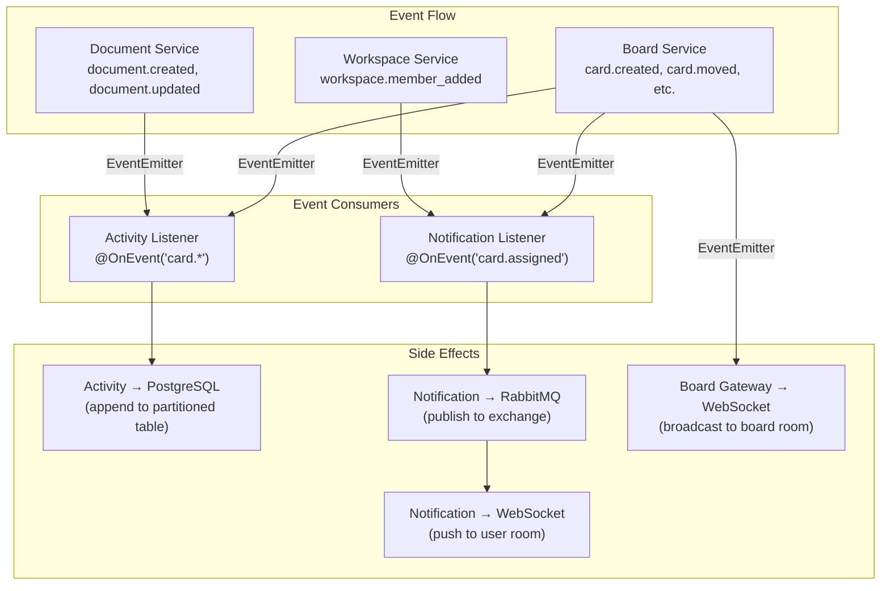

# 07 — Module Specifications

## Overview

> [!NOTE]
> Feature modules use sub-feature folders (**Aggregator Pattern**).
> Each sub-feature is its own NestJS module with its full vertical slice; the parent folder's
> `*.module.ts` aggregates and re-exports what other domains need.

Each **sub-feature** follows this internal structure:

```
src/modules/{domain}/{sub-feature}/
├── {sub-feature}.module.ts     # NestJS submodule (registered by the domain aggregator)
├── controllers/
│   └── {entity}.controller.ts  # REST endpoints
├── gateways/                   # WebSocket handlers (realtime sub-feature only)
├── services/
│   └── {entity}.service.ts     # Business logic
├── repositories/
│   └── {entity}.repository.ts  # Prisma data access
├── dto/
│   ├── create-{entity}.dto.ts
│   └── ...
├── events/
│   └── {sub-feature}.events.ts # Event payload classes + name constants
├── interfaces/
└── __tests__/                  # Co-located specs per layer
```

### Domain → Sub-feature Map

| Domain | Sub-features | Aggregator Exports |
|--------|-------------|--------------------|
| `board` | `core`, `list`, `card`, `comment`, `attachment`, `label`, `checklist`, `card-fields`, `card-time`, `views`, `realtime` | `BoardService`, `RealtimeModule` providers |
| `workspace` | Split services: `WorkspaceService`, `MembershipService`, `InvitationService` | All three services + guards |
| `auth` | Single module | `AuthService`, `JwtTokenService`, `JwtAuthGuard`, `TokenBlacklistService` |
| `activity` | `ActivityRepository` + `ActivityListener` | `ActivityService`, `ActivityRepository` |
| `mail` | `MailerService`, templates, event listeners | `MailerService` |
| `document` | `document`, `realtime` | `DocumentService` |
| `notification` | Consumer + REST | `NotificationService` |
| `file` | S3 presigned flow | `FileService` |

---

## 1. Auth Module

### Responsibility
User registration, email/password and Google OAuth authentication, dual-token lifecycle management (access/refresh), token blacklisting, password recovery, and profile management.

### Dependencies
- `PrismaModule` (persistence)
- `RedisModule` (token blacklist & unread counts)
- `ConfigModule` (JWT RS256/HS256 keys, OAuth credentials)

### Key Capabilities
- **Authentication**: Email/password registration (`RegisterDto`), credential verification, and Google OAuth SSO flow (`findOrCreateGoogleUser`).
- **Session Management**: Dual-token issuance, refresh token rotation with reuse detection (`familyId`), single-device logout, and all-device revocation (`logoutAllDevices`) via Redis JTI blacklist.
- **Account Recovery**: Ephemeral password reset tokens stored in Redis with 1-hour expiration and atomic consumption (`GETDEL`).
- **Profile**: Querying user profile, updating display info, and changing passwords.

### Events Emitted
| Event | Trigger | Payload |
|-------|---------|---------|
| `user.registered` | Successful user registration | `{ userId, email }` |
| `user.logged_in` | Successful authentication | `{ userId, method: 'email' \| 'google' }` |
| `user.password_reset_requested` | Password reset initiated | `{ userId, email, token }` |

---

## 2. Workspace Module

### Responsibility
Multi-tenant workspace lifecycle, hierarchical team membership, role-based access control (Owner, Admin, Member, Viewer), invitation workflows, and slug resolution.

### Dependencies
- `AuthModule` (identity verification)
- `PrismaModule` (database)
- `NotificationModule` (invitation dispatches)

### Key Capabilities
- **Workspace Lifecycle**: Workspace creation, retrieval by ID or slug, updating metadata, and workspace-level archival.
- **Membership & Permissions**: Member list retrieval, role elevation/demotion, member expulsion, self-leave, and atomic ownership transfer.
- **Invitations**: Secure cryptographic token generation for email invitations, listing pending invites, token-based acceptance, and invitation revocation.

### Events Emitted
| Event | Trigger | Payload |
|-------|---------|---------|
| `workspace.created` | New workspace initialized | `{ workspaceId, ownerId }` |
| `workspace.member_added` | Invitation accepted by user | `{ workspaceId, userId, role }` |
| `workspace.member_removed` | Member expelled or left | `{ workspaceId, userId }` |
| `workspace.member_role_changed` | Member permissions altered | `{ workspaceId, userId, oldRole, newRole }` |
| `workspace.invitation_created` | Email invitation sent | `{ workspaceId, email, invitedBy }` |

---

## 3. Board Module

### Responsibility
Kanban project management: boards, lists, cards, assignees, labels, comments, checklists, custom fields, time tracking, views, and real-time room broadcasting.

### Dependencies
- `AuthModule` (guards & JWT payload)
- `WorkspaceModule` (workspace membership validation)
- `PrismaModule` (database)
- `ActivityModule` (audit logging)
- `NotificationModule` (user notifications)

### Sub-feature Services
- **`BoardService`**: Board creation, workspace filtering, starred boards toggle, and two-stage soft delete (`archivedAt` restorable vs. `deletedAt` permanent).
- **`ListService`**: List CRUD, list ordering recalculation via LexoRank (`move`), and archival.
- **`CardService`**: Card CRUD, repositioning across/within lists via LexoRank, assignees management, priority/status updates, and two-stage soft delete.
- **`LabelService`**: Workspace-level label taxonomy and card association.
- **`LexorankService`**: String-based fractional indexing (`getRankBetween`, `getInitialRank`, `rebalance`) enabling $O(1)$ ordering without batch updates.
- **`CardCommentService`**: Comment posting with @mention parsing and nested reply support.
- **`CardTimeService` & `CardLinkService`**: Time estimate/logging and card dependency blocking links.

### Real-time Synchronization (`BoardGateway`)
- **Room Management**: Manages socket connections in `board:{boardId}` rooms with membership verification via `WsBoardAccessGuard`.
- **Event Relay**: Listens to internal domain events (`card.created`, `card.moved`, `list.moved`, etc.) and broadcasts real-time updates to all connected viewers in the board room.

### Key Events Emitted
| Event | Trigger | Payload Summary |
|-------|---------|-----------------|
| `board.created` / `board.archived` / `board.deleted` | Board lifecycle operations | `{ boardId, workspaceId, actorId }` |
| `list.created` / `list.moved` / `list.archived` | List modifications | `{ listId, boardId, newRank, movedBy }` |
| `card.created` / `card.updated` / `card.moved` | Card modifications | `{ cardId, boardId, fromListId, toListId, newRank }` |
| `card.assigned` | Assignee added to card | `{ cardId, boardId, assigneeId, assignedBy }` |
| `card.comment_added` | New comment posted | `{ cardId, boardId, comment, authorId }` |

---

## 4. Document Module

### Responsibility
Collaborative rich-text documentation, card-attached documents, Yjs CRDT real-time sync, debounced binary persistence, and snapshot versioning.

### Dependencies
- `AuthModule` & `WorkspaceModule` (access control)
- `PrismaModule` (persistence)
- `ActivityModule` (audit trail)

### Key Capabilities
- **Document Management**: Document CRUD, workspace filtering, card association, and full-text search.
- **In-Memory CRDT Engine (`DocumentManagerService`)**:
  - Maintains active `Y.Doc` instances in memory.
  - Merges binary CRDT updates (`Uint8Array`) from concurrent editors with zero conflicts.
  - Automatically unloads idle documents from memory after inactivity.
- **Debounced Persistence**: Buffers high-frequency edits and flushes the binary CRDT state (`BYTEA`) to PostgreSQL every 5 seconds, extracting plain text for GIN search indexing.
- **Snapshots (`SnapshotService`)**: Takes named point-in-time snapshots of the document state and supports complete state restoration.

### Events Emitted
| Event | Trigger | Payload |
|-------|---------|---------|
| `document.created` | New document initialized | `{ documentId, workspaceId, parentCardId, createdBy }` |
| `document.updated` | Metadata / title modified | `{ documentId, changes, updatedBy }` |
| `document.saved` | Debounced CRDT state persisted | `{ documentId, savedAt }` |
| `document.snapshot_created` | Historical snapshot saved | `{ documentId, snapshotId, createdBy }` |

---

## 5. Activity Module

### Responsibility
Event-sourced append-only audit trail capturing all mutations across workspaces, boards, cards, and documents.

### Dependencies
- `PrismaModule` (database)
- `EventEmitterModule` (listens to cross-module domain events)

### Architectural Mechanics
- **Event-Driven Audit**: An asynchronous listener (`ActivityListener`) intercepts domain events (`card.*`, `board.*`, `workspace.*`) and records audit entries with actor details, entity targets, and before/after payloads.
- **PostgreSQL Partitioning**: Audit records are stored in a monthly range-partitioned table (`activity_events`) to maintain query performance as logs grow into millions of rows.
- **Partition Lifecycle (`PartitionManagerService`)**: A scheduled task pre-creates upcoming monthly partitions and purges historical partitions older than the retention window.

---

## 6. Notification Module

### Responsibility
Multi-channel notification generation, persistence, caching, and real-time delivery via WebSocket and RabbitMQ.

### Dependencies
- `PrismaModule` (notification storage)
- `RedisModule` (cached unread counts)
- `RabbitMQModule` (asynchronous queue delivery)
- `EventEmitterModule` (domain event subscription)

### Delivery Pipeline Architecture

```
Domain Event (e.g. card.assigned)
  └─► Event Listener publishes message to RabbitMQ exchange
        └─► notification.queue
              └─► Notification Consumer:
                    1. Persists record in PostgreSQL
                    2. Increments Redis unread counter (notifications:unread:{userId})
                    3. Pushes notification:new to user's private WebSocket room (user:{userId})
```

### Key Capabilities
- **Inbox & Status**: Querying paginated user notifications, tracking unread counts, and marking individual or all notifications as read.
- **Resilient Delivery**: RabbitMQ decoupling ensures user notifications survive high load spikes and temporary WebSocket disconnects.

---

## 7. File Module

### Responsibility
Direct-to-cloud file storage integration via AWS S3 presigned URLs, enforcing a two-phase upload lifecycle and validating MIME types and sizes.

### Dependencies
- `AuthModule` & `WorkspaceModule` (authorization)
- `PrismaModule` (attachment metadata)
- `S3Module` (AWS SDK v3 S3 client)

### Two-Phase Upload Flow
1. **Presigned URL Generation**: Client requests an upload ticket; server verifies permissions, validates MIME type and file size (max 25MB), reserves a database record in `pending` state, and returns a short-lived presigned PUT URL.
2. **Direct Upload**: Client uploads binary data directly to S3 without passing bytes through the application server.
3. **Confirmation**: Client confirms upload completion; server marks attachment status as `completed` and attaches it to the parent card or document.

### S3 Key Structure
```
syncboard-files/
└── workspaces/{workspaceId}/
    ├── cards/{cardId}/{uuid}-{filename}
    ├── documents/{documentId}/{uuid}-{filename}
    └── avatars/{userId}/{uuid}-avatar.ext
```

---

## 8. Mail Module

### Responsibility
Transactional email delivery for account verification, password resets, and workspace invitations.

### Architectural Mechanics
- **Provider-Agnostic Abstraction**: `MailerService` abstracts SMTP transports (MailHog for local development, production SMTP providers in cloud deployments).
- **Asynchronous Execution**: Mail tasks are dispatched via RabbitMQ (`email.queue`) to avoid blocking user HTTP requests during network latency with mail providers.
- **Template Substitution**: Parameterized HTML templates for welcome emails, invitations, and password reset instructions.

---

## 9. Module Interaction Map


