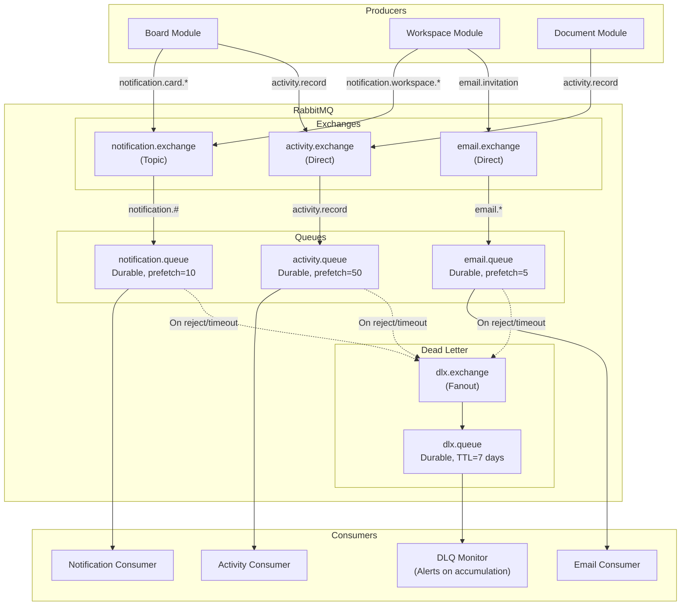

# 08 — Message Queue Design (RabbitMQ)

## 1. RabbitMQ Topology Overview



---

## 2. Exchange Configuration

### 2.1 Notification Exchange (Topic)

```typescript
// Exchange: notification.exchange
// Type: Topic — flexible routing with wildcard patterns
{
  name: 'notification.exchange',
  type: 'topic',
  durable: true,
  autoDelete: false,
}
```

**Routing keys used:**
| Routing Key | Meaning | Consumer |
|-------------|---------|----------|
| `notification.card.assigned` | User assigned to a card | notification.queue |
| `notification.card.commented` | Comment added to user's card | notification.queue |
| `notification.card.due_soon` | Card due date approaching | notification.queue |
| `notification.workspace.invited` | User invited to workspace | notification.queue |
| `notification.workspace.role_changed` | User's role changed | notification.queue |
| `notification.document.mentioned` | User mentioned in document | notification.queue |

**Binding:** `notification.queue` binds with pattern `notification.#` (catch all notification events).

<details>
<summary><strong>💡 Why Topic exchange for notifications?</strong></summary>

Topic exchange allows routing by pattern:
- `notification.#` — catch ALL notifications (main consumer).
- `notification.card.*` — a specialized consumer that only processes card-related notifications (e.g., a separate mobile push service).
- `notification.*.assigned` — catch all assignment events across entity types.

If we used Direct exchange, we'd need one binding per routing key. Topic gives flexibility to add specialized consumers later without changing producers.

</details>

### 2.2 Activity Exchange (Direct)

```typescript
{
  name: 'activity.exchange',
  type: 'direct',
  durable: true,
}
```

**Routing keys:** `activity.record` (single routing key — all activity goes to one queue).

<details>
<summary><strong>💡 Why Direct exchange for activity?</strong></summary>

All activity events go to a single queue for ordered processing. No routing flexibility needed — every event is recorded the same way. Direct exchange is simpler and slightly faster than Topic for single-key routing.

</details>

### 2.3 Email Exchange (Direct)

```typescript
{
  name: 'email.exchange',
  type: 'direct',
  durable: true,
}
```

**Routing keys:**
| Key | Meaning |
|-----|---------|
| `email.invitation` | Workspace invitation email |
| `email.password_reset` | Password reset link |
| `email.welcome` | Welcome email after registration |

---

## 3. Queue Configuration

SyncBoard defines three core queues with tailored durability, back-pressure, and concurrency settings:

| Queue Name | Durable | Dead-Letter Exchange | Routing Key | Message TTL | Max Length / Overflow | Prefetch | Processing Characteristics |
|---|---|---|---|---|---|---|---|
| `notification.queue` | ✅ | `dlx.exchange` | `dlx.notification` | None (preserves user data) | 100k (`reject-publish`) | 10 | I/O-bound: PostgreSQL insert + WebSocket push |
| `activity.queue` | ✅ | `dlx.exchange` | `dlx.activity` | 24 Hours | Unbounded | 50 | Throughput-focused: batched bulk inserts |
| `email.queue` | ✅ | `dlx.exchange` | `dlx.email` | 2 Hours | Priority enabled (1-10) | 5 | SMTP-limited: prevents outbound server throttling |

<details>
<summary><strong>💡 Why different prefetch counts?</strong></summary>

**Prefetch count** controls how many unacknowledged messages a consumer can hold:

- **Notifications (10):** Each notification involves a DB insert + WebSocket push. Medium cost per message.
- **Activity (50):** Activity recording can be batched — the consumer collects 50 events and does a single `INSERT ... VALUES (...), (...), (...)` bulk insert.
- **Email (5):** Email sending is I/O-bound (SMTP connection). Low prefetch prevents overwhelming the mail service.

Setting prefetch too high: Consumer grabs too many messages → if it crashes, all are redelivered → wasted work.
Setting prefetch too low: Under-utilization → messages sit in queue unnecessarily.

</details>

---

## 4. Message Schemas

### 4.1 Notification Message

```typescript
interface NotificationMessage {
  // Metadata
  messageId: string;          // UUID — for idempotency
  timestamp: string;          // ISO 8601
  version: 1;                 // Schema version
  
  // Notification data
  userId: string;             // Recipient
  workspaceId: string;
  type: NotificationType;     // 'card_assigned', 'comment_added', etc.
  title: string;              // Human-readable title
  body: string;               // Optional detail text
  entityType: string;         // 'card', 'board', 'document'
  entityId: string;           // UUID of the entity
  actorId: string;            // Who triggered this
  actorName: string;          // Display name (denormalized for speed)
}

type NotificationType =
  | 'card_assigned'
  | 'card_unassigned'
  | 'card_due_soon'
  | 'card_overdue'
  | 'comment_added'
  | 'comment_mentioned'
  | 'workspace_invited'
  | 'workspace_role_changed'
  | 'document_mentioned';
```

### 4.2 Activity Message

```typescript
interface ActivityMessage {
  messageId: string;
  timestamp: string;
  version: 1;
  
  workspaceId: string;
  entityType: string;
  entityId: string;
  action: string;
  actorId: string;
  payload: Record<string, any>;  // Change details
  metadata?: {
    ip?: string;
    userAgent?: string;
  };
}
```

### 4.3 Email Message

```typescript
interface EmailMessage {
  messageId: string;
  timestamp: string;
  version: 1;
  priority?: number;          // 1-10, higher = more urgent
  
  to: string;                 // Recipient email
  template: EmailTemplate;    // 'invitation', 'password_reset', 'welcome'
  data: Record<string, any>;  // Template variables
}

// Example: Invitation email
{
  messageId: "uuid",
  timestamp: "2026-08-08T12:00:00Z",
  version: 1,
  priority: 5,
  to: "newmember@example.com",
  template: "invitation",
  data: {
    workspaceName: "My Team",
    inviterName: "John Doe",
    role: "member",
    acceptUrl: "https://syncboard.app/invitations/token123/accept",
    expiresAt: "2026-08-15T12:00:00Z"
  }
}
```

---

## 5. Dead Letter Exchange (DLX)

### Why DLX?

Messages end up in the DLX when:
1. **Consumer rejects** the message (e.g., validation error).
2. **Message TTL expires** (nobody consumed it in time).
3. **Queue is full** and overflow policy is `reject-publish`.

Without DLX, these messages are silently lost. With DLX, they're captured for debugging and retry.

### DLX Setup

```typescript
// Dead Letter Exchange
{
  name: 'dlx.exchange',
  type: 'fanout',    // Route all dead letters to one queue
  durable: true,
}

// Dead Letter Queue
{
  name: 'dlx.queue',
  durable: true,
  arguments: {
    'x-message-ttl': 604800000,  // 7-day retention
    'x-max-length': 10000,       // Cap at 10k messages
  },
}
```

### Dead Letter Message Enrichment

When a message enters the DLX, RabbitMQ adds `x-death` headers:

```json
{
  "x-death": [
    {
      "queue": "notification.queue",
      "reason": "rejected",
      "count": 3,
      "time": "2026-08-08T12:00:00Z",
      "routing-keys": ["notification.card.assigned"],
      "exchange": "notification.exchange"
    }
  ]
}
```

### DLQ Monitoring

A scheduled monitor checks `dlx.queue` depth (every few minutes) and warns when
dead-lettered messages accumulate — the signal to inspect `x-death` headers and
fix the failing consumer. In production this warning feeds the alerting channel
(PagerDuty/Slack).

---

## 6. Retry Strategy

### Exponential Backoff & Retry Flow

SyncBoard implements a native, plugin-free retry mechanism using RabbitMQ message TTLs and dead-letter routing:

```
[Message Ingestion]
        │
    [Consumer Fails]
        │
   Retry Count < 3?
    ├── YES ──> Calculate Delay: 1s → 2s → 4s (Math.min(initial * 2^retries, maxDelay))
    │            └── Publish to Wait Queue `retry.wait.${delayMs}` with x-message-ttl
    │                 └── TTL expires ──> Dead-letter exchange routes back to original exchange
    │
    └── NO  ──> Terminal Failure: Reject (nack, requeue=false)
                 └── Dead-letter exchange routes to `dlx.queue` for alert monitoring
```

#### Core Retry Mechanics
* **Configurable Backoff**: Defaults to 3 retries with an exponential multiplier (`initialDelay: 1000ms`, `multiplier: 2`, `maxDelay: 30000ms`).
* **Header Tracking**: Increments `x-retry-count` in message headers across each attempt.
* **No Broker Plugins**: Utilizes transient per-delay wait queues (`retry.wait.1000`, `retry.wait.2000`) configured with dead-letter headers pointing back to the primary exchange. When the message TTL expires, RabbitMQ automatically re-delivers it.
* **Idempotent Safety**: Consumers check `msg:processed:<id>` in Redis before side-effects to prevent duplicate execution during redeliveries.

<details>
<summary><strong>💡 Why not just requeue (nack with requeue=true)?</strong></summary>

Simple requeue puts the message back at the head of the queue and it's immediately redelivered. This creates a tight retry loop that:
1. **Wastes CPU** — retrying instantly when the failure might be a temporary external service outage.
2. **Blocks the queue** — the failing message is redelivered before new messages.
3. **No backoff** — no increasing delay between retries.

Our approach: acknowledge the original, republish it into a TTL wait queue whose dead-letter
exchange routes back to the original exchange. The broker holds it for the delay duration,
then redelivers — no plugin required.

Caveat: per-queue `x-message-ttl` only expires messages at the **head** of the queue, so each
distinct delay gets its own wait queue (`retry.wait.1000`, `retry.wait.2000`, …). With the
fixed backoff schedule (1s → 2s → 4s) this is a small, known set.

</details>

---

## 7. Idempotency

All consumers must be idempotent — processing the same message twice should have no adverse effects.

```typescript
@Injectable()
export class NotificationConsumer {
  async handleNotification(msg: NotificationMessage): Promise<void> {
    // Idempotency check: use messageId as deduplication key
    const isDuplicate = await this.redis.set(
      `msg:processed:${msg.messageId}`,
      '1',
      'EX', 3600,  // 1 hour dedup window
      'NX',        // Only set if not exists
    );
    
    if (!isDuplicate) {
      this.logger.debug(`Duplicate message ${msg.messageId} — skipping`);
      return;  // Already processed
    }
    
    // Process the notification
    const notification = await this.prisma.notification.create({
      data: { ... },
    });
    
    // Push via WebSocket
    this.server.to(`user:${msg.userId}`).emit('notification:new', notification);
  }
}
```

<details>
<summary><strong>💡 Why is idempotency critical?</strong></summary>

Messages can be delivered more than once due to:
- **Consumer crash** after processing but before acknowledging → broker redelivers.
- **Network partition** → broker thinks consumer died, redelivers to another consumer.
- **Our retry mechanism** → re-publishes the message.

Without idempotency: User gets 3 duplicate notification emails, or 3 duplicate activity log entries.
With idempotency: Redis `NX` (set-if-not-exists) ensures we process each `messageId` exactly once.

</details>

---

## 8. Publisher Confirms

Ensure messages actually reach the broker:

```typescript
// Publisher (illustrative — confirm channel)
@Injectable()
export class RabbitPublisher {
  private channel: ConfirmChannel;

  async publish(
    exchange: string,
    routingKey: string,
    message: any,
  ): Promise<void> {
    const messageId = randomUUID();
    const content = Buffer.from(JSON.stringify(message));
    
    return new Promise((resolve, reject) => {
      this.channel.publish(
        exchange,
        routingKey,
        content,
        {
          persistent: true,       // Survive broker restart
          messageId,
          timestamp: Date.now(),
          contentType: 'application/json',
          headers: { version: 1 },
        },
        (err) => {
          if (err) {
            this.logger.error(`Message ${messageId} was nacked by broker`, err);
            reject(err);
          } else {
            resolve();
          }
        },
      );
    });
  }
}
```

<details>
<summary><strong>💡 What are publisher confirms?</strong></summary>

By default, `channel.publish()` is fire-and-forget — you don't know if the broker received the message. With **confirm channels**, the broker sends an ack/nack back to the publisher:

- **Ack:** Message was written to disk (if persistent) and routed to at least one queue.
- **Nack:** Broker failed to process the message (e.g., disk full).

This is essential for reliable messaging. Without confirms, messages can be silently lost between your app and the broker.

</details>

---

## 9. Monitoring & Health

The RabbitMQ broker is covered by a `@nestjs/terminus` health indicator (channel
open check) alongside the queue-depth, consumer-utilization, and unacked-message
metrics below. Thresholds are deployment-specific — tune them from the management
UI baseline.

### Key Metrics to Monitor

| Metric | What to watch |
|--------|---------------|
| Queue depth (notification) | sustained growth means the consumer is behind |
| Queue depth (DLQ) | any accumulation means a failing consumer — investigate |
| Consumer utilization | low utilization with deep queues means prefetch/scaling issue |
| Publish rate vs consume rate | publish consistently above consume means back-pressure |
| Memory usage | broker memory pressure |
| Unacked messages | stuck unacked means crashed consumers or missing acks |
