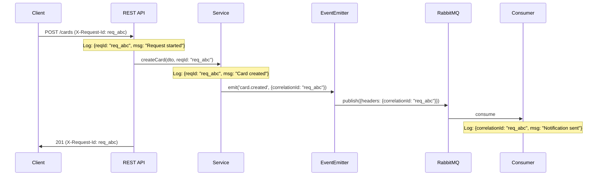

# 13 — Error Handling & Logging

## 1. Error Response Format

All API errors follow a consistent format:

```json
{
  "success": false,
  "error": {
    "code": "CARD_NOT_FOUND",
    "message": "Card with id '550e8400-e29b-41d4-a716-446655440000' was not found",
    "statusCode": 404,
    "details": {},
    "timestamp": "2026-08-08T12:00:00.000Z",
    "requestId": "req_a1b2c3d4-e5f6-7890-abcd-ef1234567890"
  }
}
```

### Validation Error (400)

```json
{
  "success": false,
  "error": {
    "code": "VALIDATION_ERROR",
    "message": "Validation failed",
    "statusCode": 400,
    "details": {
      "errors": [
        {
          "field": "email",
          "message": "email must be a valid email address",
          "value": "not-an-email"
        },
        {
          "field": "password",
          "message": "password must be at least 8 characters"
        }
      ]
    }
  }
}
```

---

## 2. Exception Hierarchy

```
Error
└── HttpException (NestJS built-in)
    ├── BadRequestException (400)
    ├── UnauthorizedException (401)
    ├── ForbiddenException (403)
    ├── NotFoundException (404)
    ├── ConflictException (409)
    └── InternalServerErrorException (500)

AppException (Custom base class)
├── EntityNotFoundException
│   ├── CardNotFoundException
│   ├── BoardNotFoundException
│   ├── WorkspaceNotFoundException
│   └── DocumentNotFoundException
├── AccessDeniedException
├── BusinessRuleException
│   ├── CardAlreadyArchivedException
│   ├── InvitationExpiredException
│   ├── TokenReusedException
│   └── FileSizeExceededException
└── ExternalServiceException
    ├── S3Exception
    ├── RabbitMQException
    └── RedisException
```

### Custom Exception Architecture

SyncBoard provides a typed exception hierarchy rooted in `AppException` (extending NestJS `HttpException`):

* **`EntityNotFoundException`**: Maps to `404 Not Found` with standardized `{ENTITY}_NOT_FOUND` codes (e.g. `CARD_NOT_FOUND`, `BOARD_NOT_FOUND`).
* **`BusinessRuleException`**: Maps to `422 Unprocessable Entity` for domain invariant violations (e.g. `INVITATION_EXPIRED`, `TOKEN_REUSED`).
* **`AccessDeniedException`**: Maps to `403 Forbidden` for permission and workspace role violations.
* **`ExternalServiceException`**: Maps to `502 Bad Gateway` or `500 Internal Error` for third-party service failures (S3, RabbitMQ, Redis).

---

## 3. Global Exception Filter Architecture

Incoming HTTP requests that throw an exception are intercepted by `AllExceptionsFilter`:

```
[Exception Thrown]
        │
        ▼
[Match Exception Type]
   ├── AppException ──────────> Extract custom errorCode & metadata details
   ├── ValidationPipe Error ──> Format into { field, message } constraint array
   ├── HttpException ─────────> Preserve status & built-in response payload
   └── Unhandled Error ───────> Log full stack trace with requestId & return 500
        │
        ▼
[Sanitize for Environment]
   └── Production: Redact internal 500 error messages & stack traces
        │
        ▼
[Emit Standard JSON Envelope]
   └── { success: false, error: { code, message, statusCode, details, timestamp, requestId } }
```

### Key Error Handling Principles
1. **Traceability**: Every error envelope includes the request correlation ID (`X-Request-Id` or Pino's `req.id`) to link client issues directly to backend log entries.
2. **Production Redaction**: In production (`NODE_ENV=production`), unhandled 500 errors return a generic message to prevent leaking internal database schemas or stack traces.
3. **Structured Validation**: DTO validation errors from `class-validator` are normalized into an array of `{ field, message }` items within the `error.details` object.

---

## 4. WebSocket Error Handling

WebSocket errors are managed via `WsExceptionFilter`:
* Intercepts both `WsException` and domain `AppException` instances thrown inside gateway handlers.
* Normalizes the error into a `{ code, message }` payload.
* Emits an `'error'` event back exclusively to the requesting socket client (`client.emit('error', ...)`), ensuring other clients in the room are unaffected.

---

SyncBoard uses `nestjs-pino` and `pino-http` for low-overhead JSON logging:

* **Output Formats**: Uses `pino-pretty` with colorized output during local development and raw, single-line JSON streams in production.
* **Sensitive Field Redaction**: Automatically censors `authorization`, `cookie`, `set-cookie`, `password`, and `refreshToken` to prevent secret leakage in log aggregators.
* **Correlation ID Binding**: Binds `req.id` from the incoming `X-Request-Id` header (or generates a UUID) onto every log statement emitted during the request lifecycle.
* **Noise Suppression**: Health check polling (`/health`) is excluded from automatic request logging.

### Production Log Format Example

```json
{
  "level": 30,
  "time": 1723104000123,
  "pid": 1,
  "hostname": "syncboard-app-prod-1",
  "reqId": "req_a1b2c3d4",
  "service": "syncboard",
  "req": {
    "method": "POST",
    "url": "/api/boards/uuid/cards",
    "remoteAddress": "192.168.1.100"
  },
  "res": { "statusCode": 201 },
  "responseTime": 45,
  "msg": "Request completed"
}
```

---

## 6. Correlation IDs

Every inbound request is assigned a unique correlation ID that propagates end-to-end:
1. **HTTP Ingestion**: `CorrelationIdInterceptor` reads `X-Request-Id` from incoming headers or generates a fresh `req_${uuid}`.
2. **Context Binding**: The ID is attached to `request.correlationId` and mirrored onto the outbound HTTP response header.
3. **Async Propagation**: Domain events (`EventEmitter2`) and RabbitMQ message headers carry the correlation ID so background workers log under the same trace ID.

### Correlation Flow



---

## 7. Log Levels Strategy

| Level | When to Use | Environment |
|---|---|---|
| `trace` | Extremely verbose: raw byte transfers, cursor delta loops | Dev only |
| `debug` | Detailed operational flow: cache hits/misses, DTO payloads | Dev, Staging |
| `info` | High-level business milestones: user registered, card moved, board created | All |
| `warn` | Recoverable anomalies: rate limit reached, queue retry triggered | All |
| `error` | Operation failures: unhandled exceptions, database query errors | All |
| `fatal` | Fatal crashes: broker connectivity loss, process out of memory | All |

### Standard Logging Pattern

```typescript
this.logger.debug(`Calculating card rank for list: ${listId}`);
this.logger.info(`Card created successfully`, { cardId: card.id, listId });
this.logger.warn(`Rate limit approached for IP: ${ip}`);
this.logger.error(`Failed to process notification message`, err.stack, { messageId });
```

---

## 8. Error Codes Registry

| Code | HTTP Status | Description |
|------|------------|-------------|
| **Auth** | | |
| `VALIDATION_ERROR` | 400 | Request body validation failed |
| `INVALID_CREDENTIALS` | 401 | Wrong email or password |
| `TOKEN_EXPIRED` | 401 | JWT access token expired |
| `TOKEN_INVALID` | 401 | JWT malformed or tampered |
| `TOKEN_REVOKED` | 401 | Token was blacklisted (logout) |
| `TOKEN_REUSE_DETECTED` | 401 | Refresh token used after rotation |
| `REFRESH_TOKEN_EXPIRED` | 401 | Refresh token past TTL |
| `FORBIDDEN` | 403 | Valid auth but insufficient role |
| **Resources** | | |
| `WORKSPACE_NOT_FOUND` | 404 | Workspace doesn't exist or archived |
| `BOARD_NOT_FOUND` | 404 | Board doesn't exist or archived |
| `LIST_NOT_FOUND` | 404 | List doesn't exist or archived |
| `CARD_NOT_FOUND` | 404 | Card doesn't exist or archived |
| `DOCUMENT_NOT_FOUND` | 404 | Document doesn't exist or archived |
| `COMMENT_NOT_FOUND` | 404 | Comment doesn't exist or deleted |
| `FILE_NOT_FOUND` | 404 | File attachment not found |
| **Conflicts** | | |
| `SLUG_ALREADY_EXISTS` | 409 | Workspace slug taken |
| `EMAIL_ALREADY_EXISTS` | 409 | Registration with existing email |
| `ALREADY_A_MEMBER` | 409 | User already in workspace |
| `INVITATION_ALREADY_SENT` | 409 | Pending invitation exists |
| **Business Rules** | | |
| `INVITATION_EXPIRED` | 422 | Invitation past expiry date |
| `INVITATION_REVOKED` | 422 | Invitation was revoked |
| `CANNOT_REMOVE_OWNER` | 422 | Cannot remove workspace owner |
| `CANNOT_CHANGE_OWNER_ROLE` | 422 | Owner role is permanent |
| `FILE_TOO_LARGE` | 422 | File exceeds 25MB limit |
| `UNSUPPORTED_FILE_TYPE` | 422 | MIME type not in allowlist |
| **Rate Limiting** | | |
| `RATE_LIMIT_EXCEEDED` | 429 | Too many requests |
| **Server** | | |
| `INTERNAL_ERROR` | 500 | Unhandled server error |
| `S3_ERROR` | 502 | S3 service unavailable |
| `DATABASE_ERROR` | 503 | PostgreSQL connection issue |
| `REDIS_ERROR` | 503 | Redis connection issue |
| `RABBITMQ_ERROR` | 503 | RabbitMQ connection issue |

---

## 9. Response Interceptor

```typescript
// Standard Response Interceptor
@Injectable()
export class ResponseInterceptor<T> implements NestInterceptor<T, ApiResponse<T>> {
  intercept(
    context: ExecutionContext,
    next: CallHandler,
  ): Observable<ApiResponse<T>> {
    const request = context.switchToHttp().getRequest();

    return next.handle().pipe(
      map((data) => ({
        success: true,
        data,
        meta: {
          timestamp: new Date().toISOString(),
          requestId: request.correlationId,
        },
      })),
    );
  }
}
```

This ensures ALL successful responses are wrapped in the standard format automatically, so controllers just `return data` without manually wrapping.
