<p align="center">
  
</p>

# SyncBoard Frontend

> Modern real-time collaborative workspace client built with **React 19**, **TypeScript**, and **Vite**.

SyncBoard Frontend is a responsive Single Page Application (SPA) designed as an interactive workbench for the SyncBoard backend engine. It combines high-velocity Kanban task management, multi-projection views (Table, Calendar, Timeline), CRDT-based collaborative rich-text documentation, and multi-tenant workspace administration.

> [!NOTE]
> **Vibe-Coded Client**: This frontend is a vibe-coded client built primarily for interactive testing, feature verification, and visual exploration of SyncBoard's backend capabilities and real-time engine.

---

## 📸 Screenshots

All screenshots are stored in [`public/screenshots/`](file:///m:/Coding/Github/sync-board/frontend/public/screenshots).

### 1. Workspaces Dashboard
*Central dashboard displaying personal and team workspaces with vanity slug routing, role badges (`Owner`, `Admin`), and fast workspace initialization.*

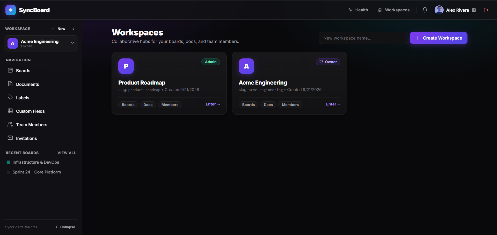

---

### 2. Workspace Overview & Boards Hub
*Central workspace hub displaying active project boards, collaborative documents count, label taxonomy, and member counts.*

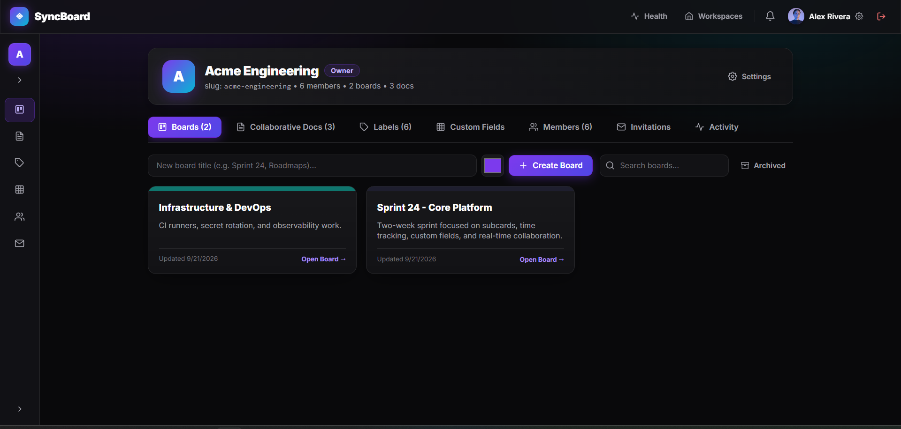

---

### 3. Real-Time Kanban Board
*Interactive drag-and-drop lists and cards powered by LexoRank with cover images, priority badges, tags, assignees, and live presence.*

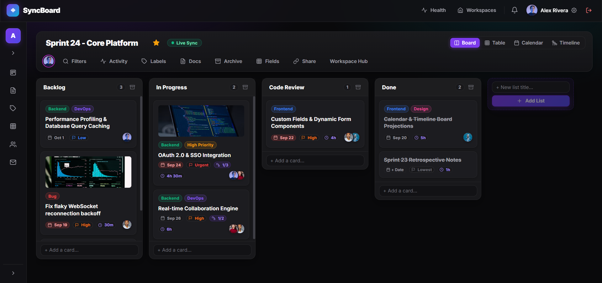

---

### 4. Multi-Projection: Sortable Data Table View
*Spreadsheet-style data grid projection with multi-column sorting, status filters, assignee filters, due date markers, subtask rollup indicators, and inline editing.*

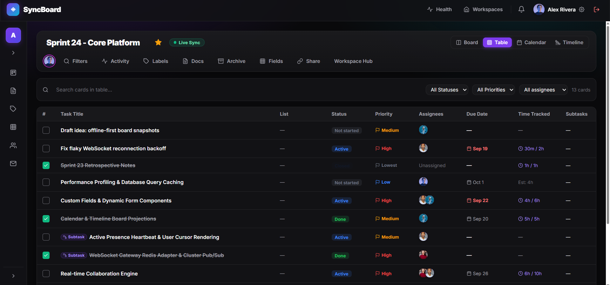

---

### 5. Multi-Projection: Monthly Calendar View
*Monthly calendar projection plotting scheduled tasks by deadline with color-coded status badges and quick date navigation.*

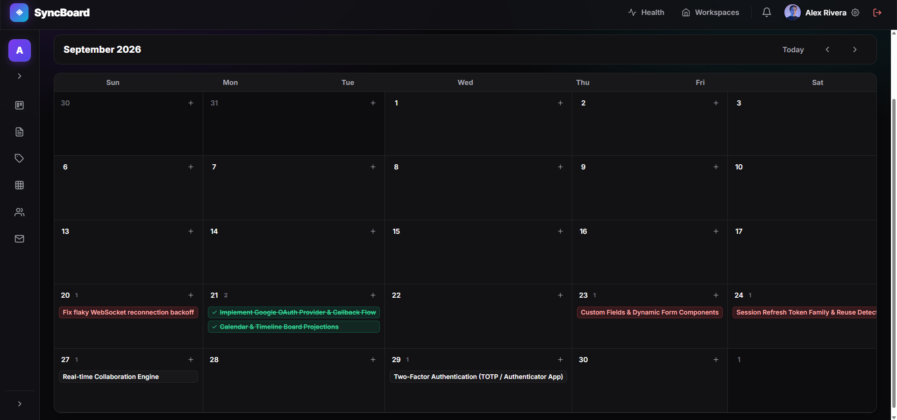

---

### 6. Multi-Projection: Chronological Timeline Roadmap
*Milestone delivery roadmap laying out tasks and dependencies chronologically with priority flags and completion state markers.*

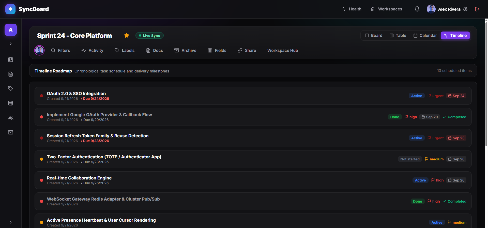

---

### 7. Card Detail Modal & Dynamic Custom Fields
*Rich card view showing descriptions, custom fields (Story Points, Release Version, Environment, Customer Impact, Reviewer), priority levels, due dates, and assignees.*

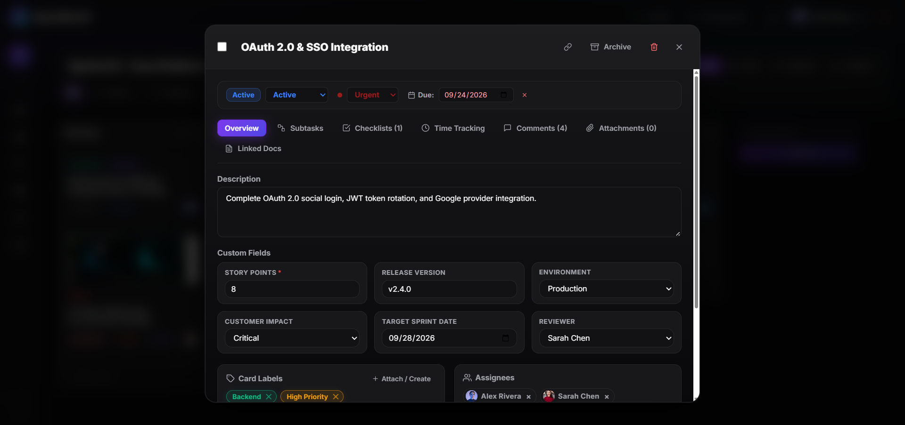

---

### 8. Hierarchical Subtasks & Progress Rollup
*Granular task decomposition supporting subcards (depth $\le 2$) with interactive status markers, priority badges, and automatic progress completion meters.*

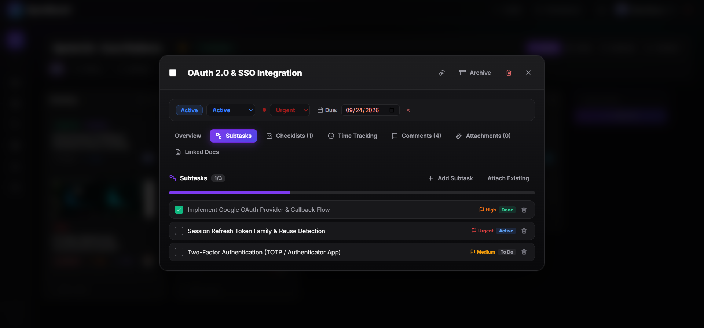

---

### 9. Time Tracking & Work Log History
*Effort estimation consumption meter (logged time vs. estimate), log work modal, and chronological work history logs per team member.*

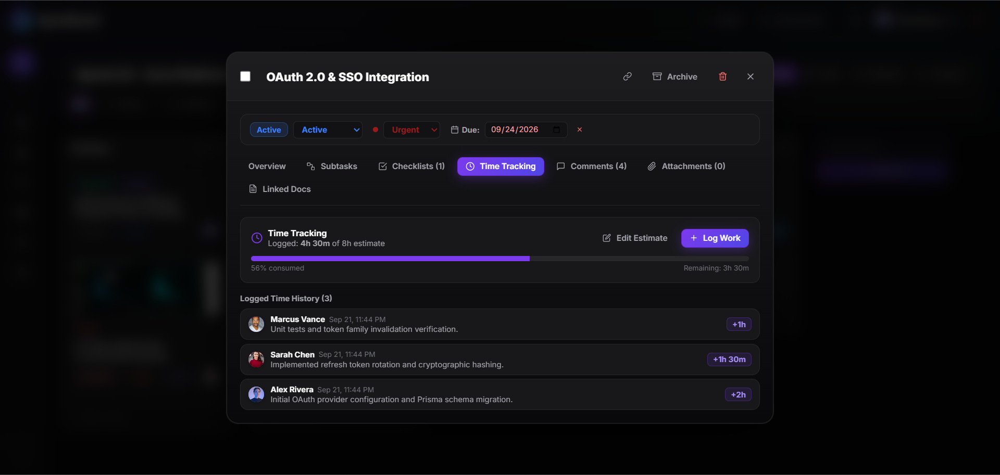

---

### 10. Collaborative Document Editor (CRDT & Awareness)
*Multiplayer Markdown document editor powered by Yjs binary CRDTs, remote presence awareness cursors (`Sarah Chen`), split-screen preview, and debounced 5-second database persistence.*

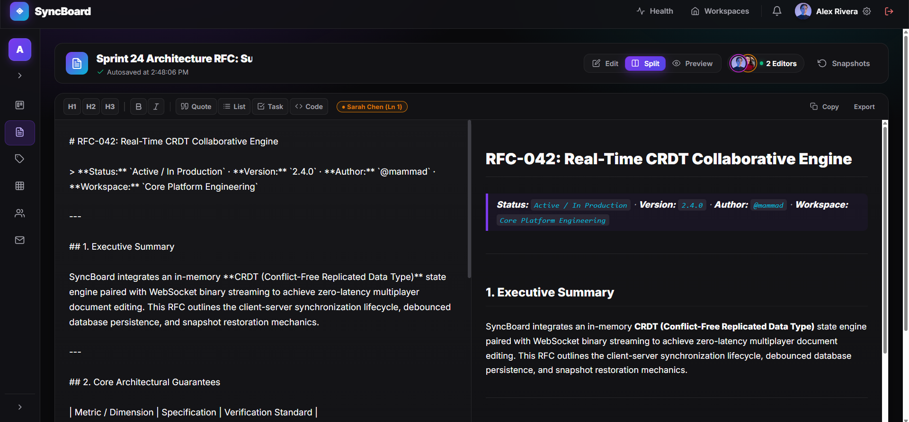

---

### 11. Real-Time Notification Center
*Live WebSocket notification popover displaying real-time unread counts, `@mention` alerts, card assignments, comment pings, and status transitions.*

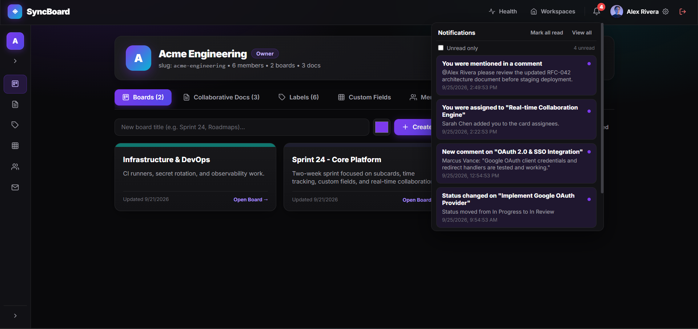

---

### 12. Workspace Team Members & 4-Tier RBAC
*Multi-tenant role administration allowing workspace owners and administrators to manage members across four roles (`Owner`, `Admin`, `Member`, `Viewer`) and transfer ownership.*

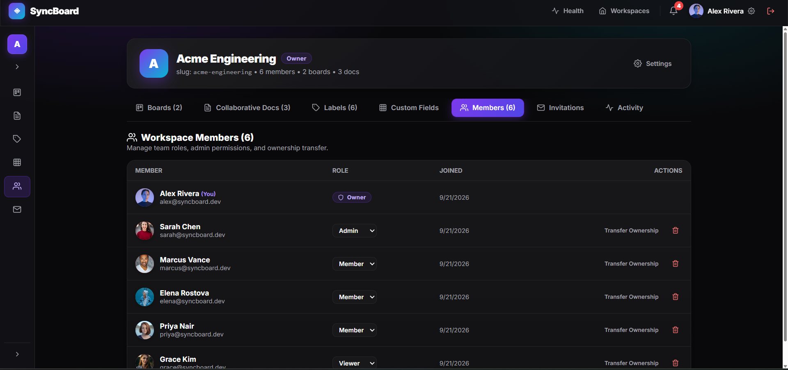

---

### 13. Workspace Custom Fields Management
*Centralized custom metadata schema builder supporting `Number`, `Text`, `Dropdown Select`, `Date`, and `User / Assignee` types enforced across all boards.*

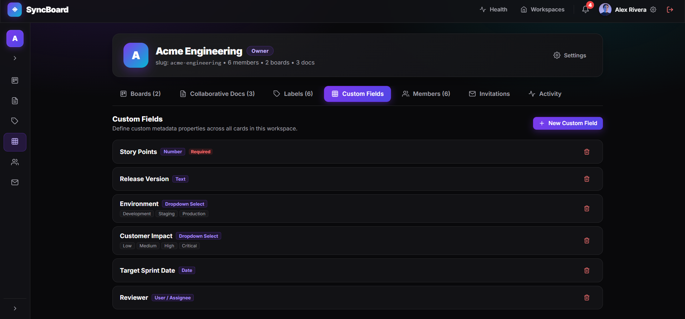

---

### 14. Workspace Taxonomy & Labels
*Workspace-wide label taxonomy with customizable color tokens and real-time board card association counts.*

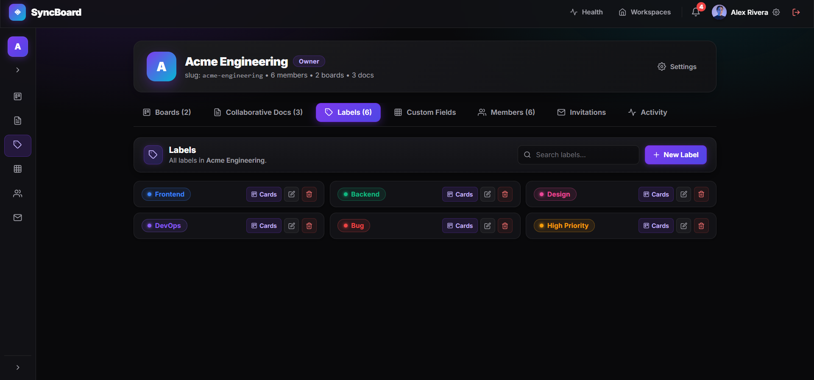

---

### 15. Collaborative Documents Library
*Workspace document repository highlighting real-time CRDT sync status and two-way associations to board cards.*

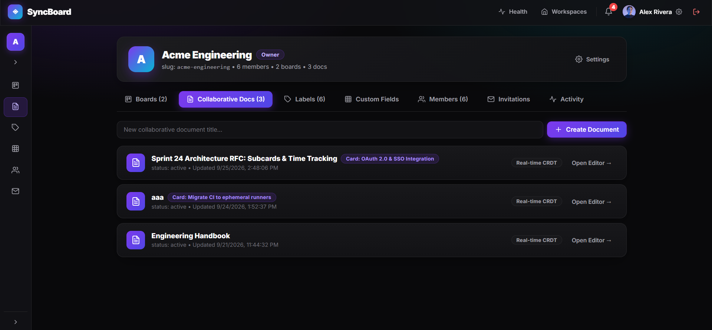

---

### 16. Board Archive & Soft-Delete Recovery
*Dedicated archive drawer allowing soft-deleted cards and workflow lists to be restored with a single click or permanently purged.*

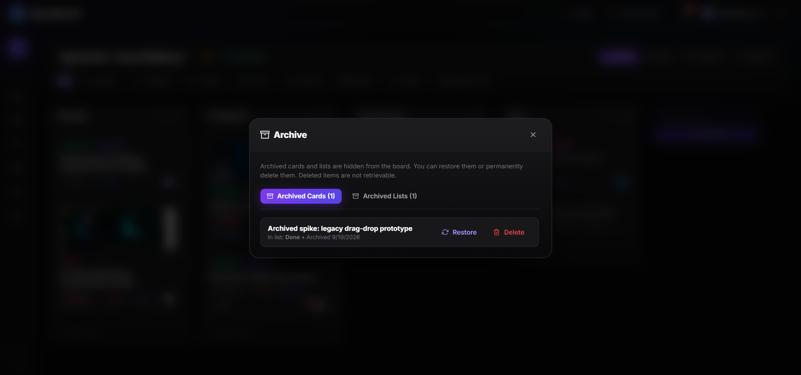

---

### 17. Board Activity Stream & Partitioned Audit Log
*Real-time audit log streaming board events (card movements, checklist completions, member assignments, comments, snapshot revisions) stored in monthly partitioned database tables.*

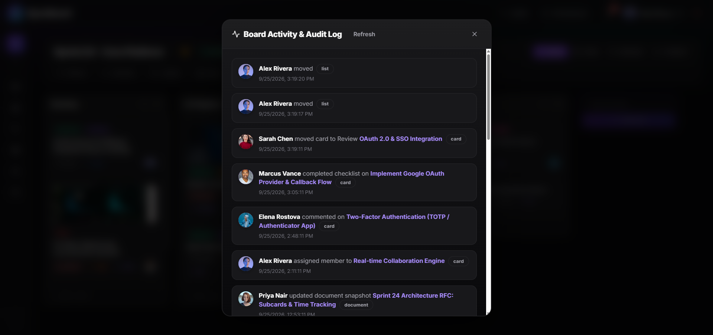

---

### 18. Authentication & Sign In
*Sign in interface with email/password authentication, Google OAuth integration, and brand logo.*

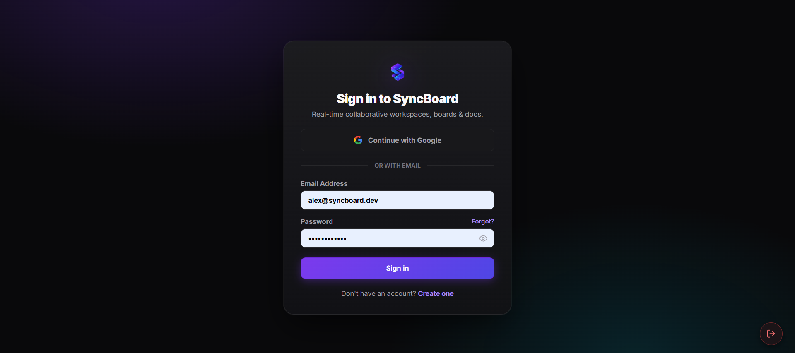

---

## ✨ Key Features

### 🏢 Workspaces & Access Control
- **Multi-Tenant Scoping**: URL vanity routing using slugs (`/workspaces/:slugOrId`).
- **Role-Based Permissions**: Granular enforcement for `owner`, `admin`, `member`, and `viewer`.
- **Team Invitations**: Cryptographic invite token flow with email delivery and acceptance.
- **Customizable Assets**: Workspace-level label taxonomy and shared custom field definitions.

### 📋 Multi-Projection Board Views
- **Segmented View Switcher**: Real-time switching between 4 distinct projections without reloading:
  - **Kanban Board**: Drag-and-drop workflow columns with `@hello-pangea/dnd` and conflict-free LexoRank ordering.
  - **Table View**: Spreadsheet-style data grid with search, multi-column sorting (Priority, Status, Due Date, Time Logged), and inline editing.
  - **Calendar View**: Monthly calendar grid plotting cards on scheduled deadlines with overdue highlights.
  - **Timeline View**: Chronological roadmap with status swimlanes and priority indicators.

### 🃏 Card Details & Task Enrichment
- **Subcards & Hierarchy**: Multi-level subtask breakdown (depth ≤ 2) with automated rollup completion meters.
- **Checklist Promotion**: Single-click conversion of checklist items into standalone subcards.
- **Workflow State Machine**: 4 card lifecycle states (`not_started`, `active`, `done`, `closed`) and 5 priority flags (`lowest` to `urgent`).
- **Time Tracking**: Estimated effort in minutes, work log history, duration inputs, and visual progress meters.
- **Custom Fields Engine**: Dynamic workspace field definitions (`text`, `number`, `date`, `select`, `user`) with live persistence.
- **Threaded Discussions**: Nested comment replies with interactive `@mention` parsing and highlights.

### 📝 Collaborative Documents
- **Real-Time CRDT Sync**: Multiplayer rich-text document editing powered by Yjs and Socket.IO.
- **Live Presence**: Collaborative awareness showing active viewer avatars and cursor coordinates.
- **Snapshot Versioning**: Point-in-time document milestones with one-click historical rollback.
- **Cross-Linking**: Direct attachment and bi-directional linking between documents and board cards.

### ⚡ Real-Time Engine & Activity Stream
- **WebSocket Rooms**: Scoped channel subscriptions (`workspace:{id}`, `board:{id}`, `user:{id}`).
- **Presence Tracking**: Online member indicators and active board viewer badges.
- **Live Audit Trail**: Slide-out Activity Drawer logging card movements, edits, and member changes in real time.
- **Notification Inbox**: Real-time notification bell with unread counters and marking actions.

### 🔐 Authentication & Session Security
- **Dual-Token Lifecycle**: Short-lived 15m JWT access tokens paired with HTTP-only refresh cookies.
- **Silent Refresh Interceptor**: Transparent token rotation with automatic session extension.
- **Multi-Device Revocation**: Single-device logout and all-device revocation through Redis blacklisting.
- **SSO & Verification**: Google OAuth 2.0 flow and email verification soft-gate banner.

---

## 🛠️ Technology Stack

| Layer | Technology | Details |
|---|---|---|
| **Core Framework** | [React 19](https://react.dev/) | Modern functional components with hooks |
| **Language** | [TypeScript](https://www.typescriptlang.org/) | Strict mode type safety matching backend DTOs |
| **Build Tool** | [Vite 8](https://vitejs.dev/) | High-speed ESM development server and Rollup bundler |
| **Routing** | [React Router v7](https://reactrouter.com/) | Declarative client-side routing |
| **State Management** | [Zustand v5](https://zustand-demo.pmnd.rs/) | Minimalist reactive stores (`auth`, `workspace`, `toast`, `ui`) |
| **Real-Time Transport** | [Socket.io Client v4](https://socket.io/) | WebSocket communication with automatic reconnection |
| **CRDT Collaboration** | [Yjs](https://yjs.dev/) | Conflict-free replicated data types for collaborative documents |
| **Drag & Drop** | [@hello-pangea/dnd](https://github.com/hello-pangea/dnd) | Accessible drag-and-drop for Kanban lists and cards |
| **Design System** | Vanilla CSS | Custom CSS properties and tokens in `src/index.css` |
| **Code Quality** | [Oxlint](https://oxc.rs/) | High-performance Rust-based linter |

---

## 🏗️ Architecture & State Flow

```
┌─────────────────────────────────────────────────────────────┐
│                    React 19 UI Layer                        │
│   (Pages · Modals · Kanban · Table · Calendar · Timeline)   │
└───────────────┬─────────────────────────────┬───────────────┘
                │                             │
        State & Dispatch              Direct Actions
                ▼                             ▼
┌──────────────────────────────┐  ┌───────────────────────────┐
│     Zustand Store Layer      │  │     REST API Client       │
│  • auth.store                │  │  • apiFetch wrapper       │
│  • workspace.store           │  │  • Silent token refresh   │
│  • toast.store               │  │  • HttpOnly cookie pass   │
│  • ui.store                  │  └─────────────┬─────────────┘
└───────────────┬──────────────┘                │
                │                               │ HTTP /api/*
                ▼                               ▼
┌──────────────────────────────┐  ┌───────────────────────────┐
│     Socket.IO Singleton      │  │      NestJS Backend       │
│  • board:{id} room events    │  │  • REST API Controllers   │
│  • user:{id} notifications   │◀─┤  • WebSocket Gateways     │
│  • presence heartbeats       │  │  • Redis Adapter Pub/Sub  │
└──────────────────────────────┘  └───────────────────────────┘
```

- **Data Fetching**: Centralized through `src/api/client.ts` (`apiFetch`). Automatically attaches the Bearer access token, handles 401 retries via `/api/auth/refresh`, and unwraps standard `{ success, data, meta }` response envelopes.
- **Real-Time Synchronization**: `src/socket/socket.ts` manages a single authenticated Socket.IO instance. When viewing a board, components register event listeners (`card:created`, `card:moved`, etc.) that update local React/Zustand state without requiring full page refetches.

---

## 🚀 Getting Started

### Prerequisites
- **Node.js**: `v20.x` or `v22.x` LTS.
- **Backend**: SyncBoard backend running on `http://localhost:3000` (see root [`README.md`](../README.md)).

### Setup & Local Development

1. Navigate to the `frontend/` directory:
   ```bash
   cd frontend
   ```

2. Install dependencies:
   ```bash
   npm install
   ```

3. Launch the development server:
   ```bash
   npm run dev
   ```

4. Access the web application at:
   👉 **[http://localhost:5173](http://localhost:5173)**

> [!NOTE]
> **Built-in Reverse Proxy**:
> Vite (`vite.config.ts`) proxies `/api` and `/socket.io` requests directly to `http://127.0.0.1:3000` with WebSocket upgrades enabled. No manual CORS configuration is necessary in development.

---

## 💻 Available Scripts

| Command | Description |
|---|---|
| `npm run dev` | Starts the Vite development server with HMR on port 5173 |
| `npm run build` | Compiles TypeScript and creates an optimized production bundle in `dist/` |
| `npm run preview` | Serves the production build locally for verification |
| `npm run lint` | Runs Oxlint across all TypeScript and TSX files |
| `npx tsc --noEmit` | Runs strict type checking without emitting build artifacts |

---

## 📁 Directory Structure

```text
frontend/
├── public/
│   ├── favicon.svg
│   ├── icons.svg                     # SVG sprite containing unified application icons
│   ├── logo.png                      # Application logo
│   └── screenshots/                  # Application screenshot assets
├── src/
│   ├── api/
│   │   ├── client.ts                 # Fetch wrapper with interceptors & auto-refresh
│   │   └── endpoints.ts              # Typed API methods grouped by domain
│   ├── components/
│   │   ├── auth/                     # EmailVerificationBanner, ProfileModal
│   │   ├── board/                    # BoardCanvas, BoardHeader, ActivityDrawer, Views
│   │   │   └── views/                # TableView, CalendarView, TimelineView
│   │   ├── card/                     # CardModal, ChecklistSection, CommentSection
│   │   ├── common/                   # Header, Sidebar, Modal, ConfirmDialog, Avatar, Toast
│   │   ├── document/                 # DocumentEditor, MarkdownViewer, SnapshotHistory
│   │   └── workspace/                # WorkspaceSettingsModal, MembersTab, InvitationsTab
│   ├── pages/                        # Page route components
│   │   ├── BoardPage.tsx             # Main Kanban and alternate projections page
│   │   ├── DocumentPage.tsx          # Real-time collaborative document view
│   │   ├── DocumentsListPage.tsx     # Workspace document explorer
│   │   ├── LoginPage.tsx             # Email and Google OAuth authentication
│   │   ├── RegisterPage.tsx          # User registration
│   │   ├── WorkspaceDetailPage.tsx   # Workspace boards and administration
│   │   └── WorkspacesPage.tsx        # Workspace directory and selector
│   ├── socket/
│   │   └── socket.ts                 # Socket.IO client singleton and event relay
│   ├── stores/                       # Reactive Zustand state stores
│   │   ├── auth.store.ts             # User identity, access tokens, and login status
│   │   ├── toast.store.ts            # Toast alerts and notification banners
│   │   ├── ui.store.ts               # UI state (drawers, active views)
│   │   └── workspace.store.ts        # Current workspace context and membership
│   ├── types/                        # TypeScript domain models and API contracts
│   ├── utils/                        # Pure utility helpers (card, date, formatting)
│   ├── App.tsx                       # Root router and layout shell
│   ├── index.css                     # Design tokens, surface colors, and typography
│   └── main.tsx                      # Application DOM bootstrap
├── package.json
├── tsconfig.json
└── vite.config.ts
```
